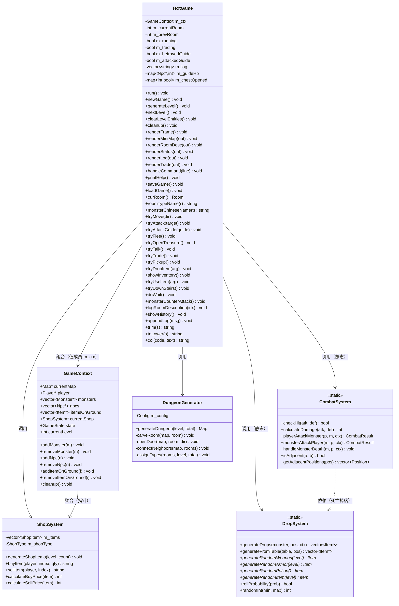
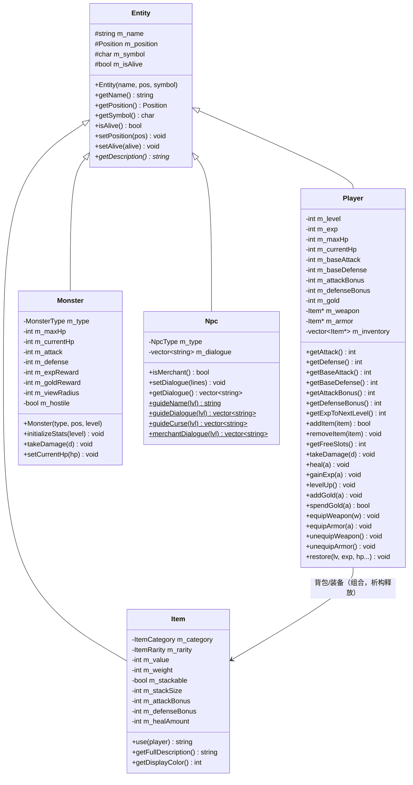
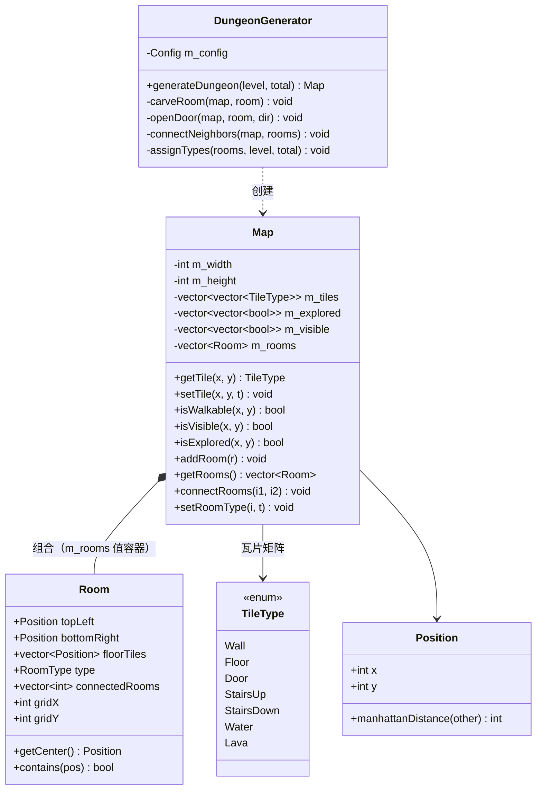

# 文字版地牢 MUD · 完整技术文档

> 版本：v2.5（逐函数级技术细节完整版）· 2026-09
> 项目：`Code-class-MUD-game` 文字版（C++17 终端文字冒险游戏）
> 代码仓库：https://github.com/BugMaker-orz/Code-class-MUD-game （main 分支）
> 阅读对象：**未接触过本项目的任何人**——评审老师、互测同学、新接手开发者
> 阅读方式：从上往下读即可；每章末尾标注了"与本项目其他部分的关联"，可跳转交叉阅读

---

## 目录

1. [项目是什么](#1-项目概述)
2. [5 分钟上手](#2-5-分钟上手)
3. [技术栈与编译环境](#3-技术栈与编译环境)
4. [目录结构（逐文件职责）](#4-目录结构逐文件职责)
5. [全局设计概览](#5-全局设计概览)
6. [核心数据结构与枚举全表](#6-核心数据结构与枚举全表)
7. [类设计详解（逐方法）](#7-类设计详解逐方法)
8. [UML 类图](#8-uml-类图)
9. [游戏主循环与状态机](#9-游戏主循环与状态机)
10. [地牢生成算法（逐步详解）](#10-地牢生成算法逐步详解)
11. [楼层填充：每类房间生成什么](#11-楼层填充每类房间生成什么)
12. [命令系统（完整解析流程）](#12-命令系统完整解析流程)
13. [战斗系统（公式与流程）](#13-战斗系统公式与流程)
14. [掉落系统（全部掉落表）](#14-掉落系统全部掉落表)
15. [商店系统](#15-商店系统)
16. [向导机制与双结局](#16-向导机制与双结局)
17. [背包、装备与消耗品](#17-背包装备与消耗品)
18. [存档 / 读档（文件格式全解）](#18-存档--读档文件格式全解)
19. [界面渲染（ANSI 与布局）](#19-界面渲染ansi-与布局)
20. [工具函数](#20-工具函数)
21. [端到端测试记录](#21-端到端测试记录)
22. [已知限制与扩展方向](#22-已知限制与扩展方向)
23. [答辩常见问题 FAQ](#23-答辩常见问题-faq)
24. [版本演进与 Git 记录](#24-版本演进与-git-记录)

---

## 1. 项目概述

### 1.1 这是什么

一款**纯文字界面（MUD 风格）的地牢探险游戏**，用 C++17 编写，零第三方依赖。玩家扮演勇者，通过**输入中文或英文命令**（而不是用方向键、鼠标）探索一个 5 层地牢：

- 每层有 6 个房间，房间之间有门相连，房间被标注属性（起点/战斗/宝箱/商店/楼梯/魔王）；
- 玩家在房间之间移动、与怪物回合制战斗、打开宝箱、与向导对话推进剧情、与商人交易买卖装备；
- 第 5 层击败魔王即通关，并根据玩家是否"背叛过向导"触发**两种不同的结局**；
- 支持随时**存档/读档**（保存为 UTF-8 文本文件）。

游戏没有图形界面——"画面"是终端里的字符画小地图 + 中文文字描述。

### 1.2 一句话玩法

```
输入「去 东」移动 → 「攻击 哥布林」战斗 → 「对话」听剧情 → 「交易」买装备 → 「下楼」进入下一层 → 第 5 层击败魔王通关
```

### 1.3 核心玩法亮点

| 亮点 | 说明 |
| --- | --- |
| 中英双语命令 | 每个命令都有中文/英文别名，大小写不敏感（`去 东` / `go east`） |
| 每层小地图 | 每次界面刷新都显示当前层的房间拓扑小地图，实时标出玩家位置 |
| 逐层剧情 | 每层向导名字、人设、台词都不同，剧情随层数推进，带"整活"风格 |
| 双结局 | 没攻击过向导 → 勇者结局；击杀过向导 → 击败魔王后成为新魔王 |
| 文本存档 | 存档是明文 `键=值` 文本，可人工检查、可跨平台 |
| 确定性数值 | 怪物属性由"类型+层数"公式决定，无随机浮动，可复现 |

### 1.4 开发历程与版本取舍（为什么是纯文字版）

项目最初尝试过带二维地图 UI 的图形版，但实际开发中发现二维渲染（地图绘制、视野计算、逐帧刷新）性能不理想，画面频繁丢帧，交互体验差。权衡后放弃了二维地图版本，把重点放在纯文字版上：全部交互改为命令输入，保留战斗、商店、掉落、地牢生成等核心玩法。因此本项目只包含 `src/text/` 专属层与核心层（角色/战斗/物品/地图），不涉及任何二维地图渲染代码。Git 提交 `8fc0b04` 有这段开发历史的说明。

---

## 2. 5 分钟上手

### 2.1 编译

```bash
mkdir build && cd build
cmake .. && cmake --build .
# Windows 生成 mud_text.exe；Linux/macOS 生成 mud_text
```

### 2.2 运行

```bash
./mud_text            # 随机种子，每次地图随机
./mud_text 42         # 固定随机种子 42，地图可复现（测试/演示用）
```

### 2.3 一局典型流程（照着输入就能通关）

```
去 东            → 移动到东边房间（若房间类型随机到战斗房，会遇到怪物）
攻击 哥布林       → 与怪物打一回合（先手），看消息里的「哥布林 HP x/y」决定是否补刀
攻击             → 攻击房间内第一只怪物（可省略怪物名）
对话             → 和向导说话，听本层剧情
交易             → 进入商店子界面（买 1 / 卖 1 / 离开）
开宝箱           → 打开宝箱房的宝箱
去 南 / 去 西 / 去 北 → 继续探索
下楼             → 在楼梯房前往下一层（每下一层恢复 6 点生命）
保存 / 读取      → 写存档 / 读档
攻击 向导        → 尝试背叛玩法（高风险高回报，会改变结局！）
帮助             → 查看全部命令
```

### 2.4 界面长什么样（每次刷新固定四部分）

```
==============================================
  地牢探险（文字版）· 第 1 层 / 共 5 层
==============================================
【小地图】当前层房间布局：
    [@]---[F]---[T]
    |     |     |
    [S]   [F]---[B]        ← @=你，S=起点，F=战斗，T=宝箱，$=商店，>=楼梯，B=魔王

  节点：[@]你 [S]起点 [F]战斗 [T]宝箱 [$]商店 [>]楼梯 [B]魔王

【当前位置】
你来到了【起点房】。
这里有 NPC：守门人·老马（向导）。
  输入「对话」听听故事。
  ⚠ 你可以攻击向导！输入「攻击 向导」夺取强力资源
    （背叛者将无法以勇者之名通关——击败魔王后，你会成为新的魔王）
出口：东→战斗房，南→起点房（输入「去 方向」移动）

【信息】
· 你来到了地牢第 1 层（共 5 层）。
· 你身处【起点房】。

【状态】【勇者】 HP 36/36 | 等级 1 | 攻 6 | 防 3 | 金币 0 | 经验 0/90
装备：[武器:无][护甲:无]

请输入指令 >
```

每次刷新固定输出：**小地图 → 当前位置描述 → 信息日志（最近 15 条）→ 状态栏**。玩家输入命令回车后整屏重绘。

---

## 3. 技术栈与编译环境

### 3.1 技术选型

| 项 | 说明 |
| --- | --- |
| 语言标准 | C++17（使用 `std::optional`、`std::map`、结构化绑定等 C++17 特性） |
| 构建系统 | CMake ≥ 3.15 |
| 支持平台 | Windows（MSVC / MinGW）、Linux、macOS |
| 第三方依赖 | **无**。仅用标准库：`iostream`、`fstream`、`vector`、`map`、`optional`、`algorithm`、`sstream`、`cstdlib`、`ctime` |
| 中文编码 | 源码全部 UTF-8；MSVC 由 CMake 强制 `/utf-8` 编译选项 |
| 终端兼容 | Windows 下启动时 `setupConsole()` 切换代码页为 UTF-8 并开启 ANSI 虚拟终端支持 |

### 3.2 CMakeLists.txt 要点

```cmake
cmake_minimum_required(VERSION 3.15)
project(mud_text CXX)
set(CMAKE_CXX_STANDARD 17)
if(MSVC)
    add_compile_options(/utf-8)          # MSVC 强制 UTF-8 源码编码，避免中文乱码
    add_compile_options(/EHsc)
endif()
add_executable(mud_text
    src/text/main_text.cpp src/text/TextGame.cpp
    src/core/GameContext.cpp
    src/character/Player.cpp src/character/Monster.cpp src/character/Npc.cpp
    src/combat/CombatSystem.cpp
    src/map/Map.cpp src/map/DungeonGenerator.cpp
    src/item/Item.cpp src/item/DropSystem.cpp src/item/ShopSystem.cpp
)
```

> 只编译文字版需要的 13 个源文件；早期二维渲染相关代码（Renderer / InputManager 等）不在编译列表中。

### 3.3 控制台编码处理（`setupConsole()`，main_text.cpp）

Windows 控制台默认代码页是 GBK（CP936），用 UTF-8 源码输出的中文会乱码。`setupConsole()` 依次做 4 件事：

1. `SetConsoleOutputCP(CP_UTF8)` + `SetConsoleCP(CP_UTF8)`：把输出、输入代码页都切成 UTF-8；
2. `_setmode(_fileno(stdout/stderr/stdin), _O_BINARY)`：以二进制模式读写，避免 CRT 层按本地代码页二次转码；
3. `setlocale(LC_ALL, ".UTF-8")`：C 运行时本地化切 UTF-8；
4. `GetConsoleMode` + `SetConsoleMode` 打开 `ENABLE_VIRTUAL_TERMINAL_PROCESSING` 标志：让 ANSI 转义序列（彩色文字）在 Windows 终端生效。

> v2.31 兼容旧版 MinGW：早期 MinGW 的 `wincon.h` 未定义 `ENABLE_VIRTUAL_TERMINAL_PROCESSING` 常量，CMake 中已手动补定义 `=0x0004`。

### 3.4 随机数

- `main()` 中 `srand(seed)`：`seed` 默认取 `time(nullptr)`（每次随机），也可用命令行参数固定（`./mud_text 42`）；
- 全项目使用 `rand()`，同一种子下地图、掉落、战斗浮动完全可复现——这是"确定性测试"的基础（见第 21 章）。

---

## 4. 目录结构（逐文件职责）

```
Code-class-MUD-game/
├── CMakeLists.txt              # 构建配置：只编译文字版 13 个源文件
├── README.md                   # 项目简介 + 中英双语命令速查表
├── 技术文档.md                  # 本文档
├── docs/
│   ├── C++课程设计-实验大纲-26新.pdf   # 课程要求
│   ├── 斗地组_实验报告.docx            # 实验报告
│   └── 斗地组_课堂展示PPT.pptx         # 课堂展示 PPT
└── src/
    ├── text/                   # ★ 文字版专属层（唯一入口层）
    │   ├── main_text.cpp       #   程序入口：setupConsole + srand + 创建 TextGame + run()
    │   ├── TextGame.h          #   主控类声明（成员变量 + 全部私有方法）
    │   └── TextGame.cpp        #   主控实现（1521 行）：主循环/命令分发/渲染/存档/玩法逻辑
    ├── core/                   # 基础层
    │   ├── Entity.h            #   实体基类：名字/坐标/符号/存活，纯虚 getDescription()
    │   ├── Position.h          #   二维坐标值对象 + 曼哈顿距离
    │   ├── TileType.h          #   瓦片枚举：Wall/Floor/Door/StairsUp/StairsDown/Water/Lava
    │   └── GameContext.h/.cpp  #   全局状态容器：地图/玩家/怪物/NPC/地面物品/商店
    ├── character/              # 角色层
    │   ├── Player.h/.cpp       #   玩家：成长/背包/装备/升级/读档恢复
    │   ├── Monster.h/.cpp      #   怪物：6 种类型，属性由类型+层数确定
    │   └── Npc.h/.cpp          #   NPC：向导/商人，逐层台词与咒骂
    ├── combat/
    │   └── CombatSystem.h/.cpp #   战斗结算：命中/伤害/击杀/掉落/反击
    ├── map/
    │   ├── Map.h/.cpp          #   地图：瓦片矩阵 + 房间列表 + 连通关系
    │   └── DungeonGenerator.h/.cpp # 地牢生成器：布局/挖房/开门/连邻/标属性
    └── item/
        ├── Item.h/.cpp         #   物品：类别/稀有度/加成/使用/描述
        ├── DropSystem.h/.cpp   #   掉落：6 张掉落表 + 随机装备生成
        └── ShopSystem.h/.cpp   #   商店：货架生成/买入/卖出/定价
```

---

## 5. 全局设计概览

### 5.1 分层架构

```
┌─────────────────────────────────────────────┐
│  入口层  main_text.cpp                       │  → setupConsole() 初始化终端
└──────────────────┬──────────────────────────┘
┌──────────────────▼──────────────────────────┐
│  主控层  TextGame                            │  → 主循环、命令分发、渲染、存档
│  持有：GameContext m_ctx（值成员）             │
│  调用：CombatSystem / DropSystem /           │
│        ShopSystem / DungeonGenerator（静态）  │
└──────────────────┬──────────────────────────┘
┌──────────────────▼──────────────────────────┐
│  状态层  GameContext                         │  → 全局数据容器（指针持有各实体）
└──────────┬──────────┬──────────┬────────────┘
           │          │          │
   ┌───────▼──┐  ┌────▼─────┐  ┌▼──────────┐
   │ 实体层    │  │ 地图层    │  │ 系统层     │
   │ Entity   │  │ Map      │  │ CombatSystem│
   │ ├ Player │  │ Room     │  │ DropSystem │
   │ ├ Monster│  │ Dungeon  │  │ ShopSystem │
   │ ├ Npc    │  │Generator │  │            │
   │ └ Item   │  │ TileType │  │            │
   └──────────┘  └──────────┘  └────────────┘
```

- **实体层**（Entity 派生）：场景中"有名字有位置"的东西，继承关系 `Player/Monster/Npc/Item <|-- Entity`；
- **地图层**：瓦片网格 + 房间拓扑，由 DungeonGenerator 生成；
- **系统层**：无状态静态工具（战斗/掉落）与业务类（商店），被 TextGame 直接调用。

### 5.2 一次"攻击命令"的完整调用链（示例）

```
用户输入「攻击 哥布林」
  → TextGame::handleCommand("攻击 哥布林")      命令解析，识别为攻击
  → TextGame::tryAttack("哥布林")               查找房间内怪物
  → CombatSystem::playerAttackMonster(p, m, ctx) 玩家回合（命中→伤害→击杀判定）
  → [未击杀] CombatSystem::monsterAttackPlayer(m, p, ctx) 怪物反击
  → [击杀]   CombatSystem::handleMonsterDeath(m, p, ctx)   发经验/金币/掉落
  → DropSystem::generateDrops(m, pos, ctx)      掷骰生成掉落物品
  → TextGame 把消息写入 m_log，下一帧 renderFrame() 显示
```

---

## 6. 核心数据结构与枚举全表

### 6.1 枚举一览

| 枚举 | 定义处 | 取值 |
| --- | --- | --- |
| `TileType`（瓦片） | `core/TileType.h` | `Wall` 墙、`Floor` 地板、`Door` 门、`StairsUp` 上楼、`StairsDown` 下楼、`Water` 水、`Lava` 岩浆 |
| `Map::RoomType`（房间属性） | `map/Map.h` | `Normal` 普通、`Start` 起点、`Boss` 魔王、`Treasure` 宝箱、`Shop` 商店、`StairsDown` 楼梯、`Corridor` 走廊 |
| `GameContext::GameState`（游戏状态） | `core/GameContext.h` | `Menu` 菜单、`Playing` 游玩中、`Inventory` 背包、`Shop` 商店、`Talk` 对话、`Dead` 死亡、`Victory` 胜利 |
| `MonsterType`（怪物类型） | `character/Monster.h` | `Goblin` 哥布林、`Skeleton` 骷髅、`Bat` 蝙蝠、`Slime` 史莱姆、`Orc` 兽人、`Boss` 魔王 |
| `Monster::AIState` | `character/Monster.h` | `Idle`/`Patrol`/`Chase`/`Attack`（为二维版预留，纯文字版仅置 `Idle`） |
| `Npc::NpcType`（NPC 类型） | `character/Npc.h` | `Guide` 向导、`Merchant` 商人、`Elder` 长者 |
| `ItemCategory`（物品类别） | `item/Item.h` | `Weapon` 武器、`Armor` 护甲、`Potion` 药水、`Scroll` 卷轴、`Gold` 金币、`Key` 钥匙、`Food` 食物、`QuestItem` 任务物品 |
| `ItemRarity`（稀有度） | `item/Item.h` | `Common` 普通、`Uncommon` 精良、`Rare` 稀有、`Epic` 史诗、`Legendary` 传说 |
| `ShopSystem::ShopType`（店铺类型） | `item/ShopSystem.h` | `General` 综合、`Weapon` 武器店、`Armor` 护甲店、`BlackMarket` 黑市 |
| 中文类别映射 | `item/Item.cpp` | `categoryToChinese()`：武器/护甲/药水/卷轴/金币/钥匙/食物/任务物品 |
| 中文稀有度映射 | `item/Item.cpp` | `rarityToChinese()`：普通/精良/稀有/史诗/传说 |

### 6.2 结构体详解

**`Position`（core/Position.h）**——二维坐标值对象

```cpp
struct Position {
    int x, y;
    bool operator==(const Position&) const;      // 坐标相等
    bool operator!=(const Position&) const;
    int manhattanDistance(const Position&) const; // |Δx| + |Δy|
};
```

用途：所有实体坐标、房间矩形角点、物品落地点都用它。曼哈顿距离 ≤ 1 即"相邻"（用于战斗系统 `isAdjacent`）。

**`Map::Room`（map/Map.h）**——房间结构体

| 字段 | 类型 | 含义 |
| --- | --- | --- |
| `topLeft` / `bottomRight` | `Position` | 房间矩形角点（含墙边框） |
| `floorTiles` | `vector<Position>` | 房间内部地板格（为二维版预留） |
| `type` | `RoomType` | 房间属性（起点/战斗/宝箱/商店/楼梯/魔王） |
| `connectedRooms` | `vector<int>` | 连通邻居的房间下标列表（双向写入） |
| `gridX` / `gridY` | `int` | 房间在关卡网格中的坐标（用于小地图布局），初始 -1 |
| `getCenter()` | — | 返回房间中心点 `((x0+x1)/2, (y0+y1)/2)` |
| `contains(pos)` | — | 判断点是否在房间矩形内（含边界） |

**`ShopItem`（item/ShopSystem.h）**——货架条目

```cpp
struct ShopItem { Item* item; int buyPrice; int sellPrice; int quantity; };
// quantity 为 -1 表示无限库存（本作所有商品都是 -1）
```

**`DropEntry`（item/DropSystem.h）**——掉落表条目

```cpp
struct DropEntry {
    ItemCategory category;   // 物品类别
    std::string name;        // 物品名
    char symbol;             // 显示符号
    float probability;       // 掉落概率 0~1
    int minCount, maxCount;  // 掉落数量范围
    int value;               // 价值（金币用）
    int attackBonus;         // 攻击加成（武器用）
    int defenseBonus;        // 防御加成（护甲用）
    int healAmount;          // 治疗量（药水用）
    ItemRarity rarity;       // 稀有度
};
```

**`CombatResult`（combat/CombatSystem.h）**——单回合战斗结果

```cpp
struct CombatResult {
    int damageDealt = 0;      // 本回合对目标造成的伤害
    int damageReceived = 0;   // 本回合受到的反击伤害
    bool targetKilled = false;// 目标是否被击杀
    int expGained = 0;        // 击杀获得经验
    int goldGained = 0;       // 击杀获得金币
    std::string message;      // 可展示的完整消息（含怪物剩余血量）
};
```

**`DungeonGenerator::Config`（map/DungeonGenerator.h）**——地牢参数

```cpp
struct Config {
    int roomsPerLevel = 6;   // 每层房间数（排成矩形网格：3×2 或 2×3）
    int roomWidth = 13;      // 房间含墙宽（内部地板 11 格）
    int roomHeight = 9;      // 房间含墙高（内部地板 7 格）
    int gap = 1;             // 房间之间墙的间隔
};
```

### 6.3 实体基类 `Entity`（core/Entity.h）

所有场景对象（玩家/怪物/NPC/物品）的公共基类：

| 成员 | 类型 | 说明 |
| --- | --- | --- |
| `m_name` | `string`（protected） | 显示名称 |
| `m_position` | `Position`（protected） | 所在坐标 |
| `m_symbol` | `char`（protected） | 地图显示符号（玩家 `@`、怪物 `g/s/b/m/o/B`、NPC `?/$`、物品 `$!/[` 等） |
| `m_isAlive` | `bool`（protected） | 存活标记 |

接口：`getName()` / `getPosition()` / `getSymbol()` / `isAlive()` / `setPosition()` / `setAlive()`，以及**纯虚函数** `getDescription()`——派生类各自实现描述文本（怪物显示血量、玩家显示属性、物品显示名称），状态栏/战斗消息复用。

---

## 7. 类设计详解（逐方法）

> 本节按"类 → 职责 → 关键成员 → 每个方法（功能 / 参数 / 返回值 / 实现逻辑）"组织，是评审提问时的"答案页"。

### 7.1 `Player`（character/Player.h/.cpp）

**职责**：玩家的成长、背包、装备。继承 `Entity`，显示符号固定 `@`。

**关键成员**：

| 成员 | 初始值 | 含义 |
| --- | --- | --- |
| `m_level` | 1 | 等级 |
| `m_exp` | 0 | 当前经验 |
| `m_maxHp` | 36 | 生命上限 |
| `m_currentHp` | 36 | 当前生命 |
| `m_baseAttack` | 6 | 基础攻击（不含装备） |
| `m_baseDefense` | 3 | 基础防御（不含装备） |
| `m_gold` | 0 | 金币 |
| `m_attackBonus` / `m_defenseBonus` | 0 / 0 | 装备攻击/防御加成总和 |
| `m_weapon` / `m_armor` | `nullptr` | 当前装备的武器/护甲指针 |
| `m_inventory` | 空 | 背包（容量上限 `MAX_INVENTORY_SIZE = 20`） |

**方法逐一说明**：

| 方法签名 | 功能 / 参数 / 返回 | 实现逻辑 |
| --- | --- | --- |
| `Player(name, pos)` | 构造 | 按上表初始化全部成员；`Entity(name, pos, '@')` |
| `~Player()` | 析构 | `for (auto it : m_inventory) delete it;` 释放背包所有物品（所有权归 Player） |
| `getAttack()` / `getDefense()` | 返回总攻/总防 | `基础值 + 装备加成`（即 `getBaseAttack()+getAttackBonus()`） |
| `getBaseAttack()` / `getBaseDefense()` | 返回基础攻/防 | 只返回 `m_baseAttack` / `m_baseDefense`，用于状态栏显示"基础值(+加成)" |
| `getAttackBonus()` / `getDefenseBonus()` | 返回装备加成 | 装备武器/护甲时累加，卸下时扣除 |
| `getExpToNextLevel()` | 返回升级所需经验 | `60 + m_level * 30`（v2.2 加快后的曲线：1→2 级需 90，逐级 +30） |
| `addItem(Item*)` | 入背包 | **容量满时返回 false 且不吞物品**（不改变任何状态），调用方决定物品去向（留地/滑落）——这是 v2.4"背包满不丢物品"的核心 |
| `removeItem(Item*)` | 移出背包 | `std::find` 定位后 `erase`，不释放对象 |
| `hasItem(Item*)` | 判断是否在背包 | 线性查找 |
| `getFreeSlots()` | 剩余格子 | `20 - m_inventory.size()` |
| `takeDamage(int d)` | 受伤 | `m_currentHp -= d`，下限 0，归零置 `m_isAlive=false` |
| `heal(int a)` | 治疗 | `m_currentHp += a`，上限 `m_maxHp` |
| `gainExp(int a)` | 加经验 | `m_exp += a`；**while 循环**连续判断 `m_exp >= getExpToNextLevel()` 则 `m_exp -= 门槛; levelUp()`——溢出经验跨级消化（读档恢复高经验时同样成立） |
| `levelUp()` | 升级 | `m_level++`；`m_maxHp += 5` 并**回满血**；`m_baseAttack += 1`；`m_baseDefense += 1` |
| `addGold(int)` / `spendGold(int)` | 加/扣金币 | 扣金币先判断余额，不足返回 false |
| `equipWeapon(Item*)` | 装备武器 | 先 `unequipWeapon()` 卸旧，再挂新武器并把其 `getAttackBonus()` 累加进 `m_attackBonus` |
| `equipArmor(Item*)` | 装备护甲 | 同上逻辑，累加防御加成 |
| `unequipWeapon()` / `unequipArmor()` | 卸下装备 | 从加成中**扣除**该装备的加成，指针置空 |
| `restore(level, exp, maxHp, hp, baseAtk, baseDef, gold)` | 读档恢复 | 覆盖全部成长属性；`m_attackBonus/m_defenseBonus` 清零（随后由 `equip` 重建）；同样用 while 消化溢出经验；`hp` 夹到 `[1, maxHp]`；`m_isAlive=true` |
| `getDescription()` | 描述文本 | `名字 等级X 生命 a/b 攻击 C 防御 D` + 若有武器/护甲附加 `武器:XX 护甲:XX` |

### 7.2 `Monster`（character/Monster.h/.cpp）

**职责**：6 种怪物的属性与受伤。继承 `Entity`。**属性完全由"类型+层数"确定**，不落盘、不随机。

**构造**：`Monster(type, pos, level)`——按类型设置中文名与符号（哥布林 `g` / 骷髅 `s` / 蝙蝠 `b` / 史莱姆 `m` / 兽人 `o` / 魔王 `B`），再 `initializeStats(level)`。

**`initializeStats(level)` 属性公式（确定性，v2.2 平衡后）**：

| 怪物 | 满血 maxHp | 攻击 | 防御 | 经验奖励 | 金币奖励 | 视野（预留） |
| --- | --- | --- | --- | --- | --- | --- |
| 哥布林 | 10 + 层×2 | 3 + 层 | 1 | 10 + 层×2 | 5 + 层 | 4 |
| 骷髅 | 15 + 层×3 | 5 + 层 | 3 | 15 + 层×3 | 8 + 层 | 5 |
| 蝙蝠 | 5 + 层 | 2 + 层 | 0 | 5 + 层 | 1 | 5 |
| 史莱姆 | 8 + 层×2 | 1 + 层 | 0 | 5 + 层 | 2 | 3 |
| 兽人 | 25 + 层×4 | 8 + 层 | 5 | 30 + 层×5 | 15 + 层 | 5 |
| 魔王 Boss | 60 + 层×10 | 10 + 层 | 7 | 100 + 层×10 | 50 + 层 | 7 |

定位：蝙蝠脆而快（低血低奖励）、兽人血厚、骷髅/哥布林均衡、魔王为全游戏最高数值。

**其他方法**：

| 方法 | 逻辑 |
| --- | --- |
| `takeDamage(int d)` | 扣血，下限 0，归零 `m_isAlive=false` |
| `setCurrentHp(int hp)` | 读档恢复残血：夹到 `[0, maxHp]`，≤0 判定死亡 |
| `getDescription()` | `名字（生命 当前/满血）`——战斗消息复用 |
| `setHostile()` / `getAIState()` | 为二维版预留，纯文字版怪物始终敌对 |

### 7.3 `Npc`（character/Npc.h/.cpp）

**职责**：向导与商人。继承 `Entity`。

**成员**：`m_type`（Guide/Merchant/Elder）、`m_dialogue`（台词行 vector）。

**构造默认台词**：向导默认是"老向导欢迎词（WASD 移动）"，商人默认"欢迎光临"——但这些默认台词实际会被 `generateLevel()` 中按层数生成的台词覆盖（见下）。

**静态台词生成（剧情逐层推进 + 整活）**：

`guideName(lvl)`——每层向导名字：

| 层 | 向导 | 人设 |
| --- | --- | --- |
| 1 | 守门人·老马 | 腰不好的守门人 |
| 2 | 工头·大锤 | 矿工头子 |
| 3 | 修女·阿贞 | 临时修女 |
| 4 | 队长·刀疤 | 巡逻队长 |
| 5 | 神秘人·黑哥 | 神秘人 |

`guideDialogue(lvl)`——每层向导剧情台词（6 句/层），核心剧情线：

- 第 1 层：介绍魔王"黑渊之眼"三年前被召唤出来、找楼梯下楼、打不过就逃跑；
- 第 2 层：爆料"炼金术士其实是被人坑的——他那个助手才是主谋"；
- 第 3 层：补充"助手其实是魔王旧部，骗术士念了禁忌咒语后跑了"；
- 第 4 层：魔王情报"眼睛比城门还大、眼皮也大、逃跑它未必追得上"，商店装备是摆设；
- 第 5 层：魔王"想家了"、没有楼梯是单行道、赢了他请吃烤串。

`guideCurse(lvl)`——被玩家攻击后拒绝对话的咒骂（2 句/层，鲜红），例如第 1 层"滚！亏我一把年纪还给你指路，你转头就砍我？"。

`merchantDialogue(lvl)`——商人台词逐层变化（第 5 层："最后一条命了哥们，要不要来瓶药水？买二送一，送的那瓶可能是空的"）。

> **整活风格**：台词融入"上热搜、不报工伤、烟花、烤串"等网络梗，作为评审演示的记忆点。

### 7.4 `Item`（item/Item.h/.cpp）

**职责**：物品实体。继承 `Entity`。

**构造**：`Item(name, symbol, category, rarity=Common)`。默认价值按类别：药水 10、武器/护甲 20、金币 1、其他 5。

**方法**：

| 方法 | 逻辑 |
| --- | --- |
| `use(Player&)` | 按类别分派：药水→`player.heal(healAmount)`；武器→`player.equipWeapon(this)`；护甲→`player.equipArmor(this)`；食物→`player.heal(healAmount>0?healAmount:5)`；其余→"这个东西现在用不了"。返回中文反馈消息 |
| `getFullDescription()` | `[稀有度]名称（类别，攻击+X/防御+X/恢复X）价值 X 金币`——背包与商店展示 |
| `getDescription()` | 只返回名称 |
| `getDisplayColor()` | 预留返回 37（白色） |
| setter | `setValue/setAttackBonus/setDefenseBonus/setHealAmount/setStackSize` 等 |

### 7.5 `Map`（map/Map.h/.cpp）

**职责**：二维瓦片网格 + 房间列表 + 连通关系。

**构造**：`Map(w, h)` 生成全墙矩阵；`Map(w, h, data)` 用给定数据。

**关键方法**：

| 方法 | 逻辑 |
| --- | --- |
| `getTile(x,y)` | 越界统一返回 `Wall`，避免越界崩溃 |
| `setTile(x,y,type)` | 越界忽略 |
| `isWalkable(x,y)` | `Floor / Door / StairsUp / StairsDown` 可通过；墙、水、岩浆不可通过 |
| `isVisible/isExplored` + `setVisible/setExplored` | 视野/探索矩阵（纯文字版在生成时全部置 true = 全视野） |
| `addRoom/connectRooms/setRoomType` | 房间管理；`connectRooms` **双向**写入 `connectedRooms` |
| `getRoom(i)` / `getRooms()` | 房间访问（下标越界返回 nullptr） |

### 7.6 `DungeonGenerator`（map/DungeonGenerator.h/.cpp）

**职责**：元气骑士式分层地牢生成。详见第 10 章算法详解。

### 7.7 `CombatSystem`（combat/CombatSystem.h/.cpp）

**职责**：全部静态、无状态的战斗结算。

| 方法 | 功能 | 实现逻辑 |
| --- | --- | --- |
| `checkHit(atk, def)` | 命中判定 | `hitChance = 70 + atk*2 - def*2`，夹到 `[20, 95]`，返回 `rand()%100 < hitChance` |
| `calculateDamage(atk, def)` | 伤害计算 | `base = atk - def/2`（下限 1），返回 `base + rand()%3`（0~2 随机浮动） |
| `playerAttackMonster(p, m, ctx)` | 玩家回合 | ① 未命中→返回落空消息（带怪物 HP x/y）；② 命中→扣怪物血、记录伤害；③ 击杀→置 `targetKilled`、记经验/金币、调 `handleMonsterDeath`；④ 未击杀→消息追加怪物剩余血量 |
| `monsterAttackPlayer(m, p, ctx)` | 怪物回合 | ① 未命中→返回未打中消息；② 命中→扣玩家血、记录；③ 玩家死亡→`context.state = Dead` |
| `handleMonsterDeath(m, p, ctx)` | 死亡结算 | `player.gainExp(expReward)` + `player.addGold(goldReward)` + `DropSystem::generateDrops` 生成的物品加入 `itemsOnGround` + `context.removeMonster(m)`（只移除不 delete，所有权归 GameContext） |
| `isAdjacent(a, b)` | 相邻判定 | 曼哈顿距离 ≤ 1 |
| `getAdjacentPositions(pos)` | 取 8 邻 | 生成周围 8 格坐标（二维版预留） |

### 7.8 `DropSystem`（item/DropSystem.h/.cpp）

**职责**：全部静态的掉落生成。详见第 14 章掉落表。

| 方法 | 逻辑 |
| --- | --- |
| `generateDrops(monster, pos, ctx)` | 按怪物类型选掉落表 → `generateFromTable` |
| `generateFromTable(table, pos)` | 逐条 `rollProbability(概率)`，命中则生成 `randomInt(min,max)` 个物品，`setPosition(pos)`，加入结果列表 |
| `rollProbability(prob)` | `(rand()%100)/100.0f < prob` |
| `randomInt(min, max)` | `min + rand()%(max-min+1)` |
| `generateRandomWeapon(level)` | 名字池{铁剑/长剑/战斧/精钢剑}随机；稀有度 `level>3 ? Rare : Uncommon`；攻击加成 `level + rand()%3`；价值 `20+level*5` |
| `generateRandomArmor(level)` | 名字池{皮甲/锁子甲/铁甲/鳞甲}；防御加成 `level + rand()%2` |
| `generateRandomPotion()` | 治疗药水：治疗 10、价值 10 |
| `generateRandomItem(level)` | `rand()%3`：0→武器、1→护甲、2→药水 |

### 7.9 `ShopSystem`（item/ShopSystem.h/.cpp）

**职责**：商店货架与买卖结算。业务类（非静态）。

| 方法 | 逻辑 |
| --- | --- |
| `generateShopItems(level, count=6)` | 先删旧货架，再按 `m_shopType` 分派生成（综合店=randomItem×N / 武器店=randomWeapon×N / 护甲店=randomArmor×N），每件算好买/卖价、`quantity=-1`（无限库存） |
| `buyItem(player, index, qty)` | 校验顺序：下标合法 → 库存够 → **背包容量够（非金币商品需占格，满了拒绝且不扣钱）** → 金币够 → 复制商品入背包 → 扣款。返回中文消息（空串表示成功） |
| `sellItem(player, inventoryIndex)` | 按 `calculateSellPrice` 结算金币 → 从背包移除并 `delete` 物品 |
| `calculateBuyPrice(item)` | `value * 2` |
| `calculateSellPrice(item)` | `value / 2`（商店吃一半差价） |
| `getBuyableDescriptions()` | 货架描述列表（"名字 - 价格 gold"） |

> **防扣钱陷阱（v2.4）**：背包容量检查放在 `spendGold` 之前——否则会出现"扣了钱但装不下"。

### 7.10 `GameContext`（core/GameContext.h/.cpp）

**职责**：全局状态容器，TextGame 通过它访问所有数据。

**成员**：`currentMap`、`player`、`monsters`、`npcs`、`itemsOnGround`、`messageLog`、`pendingDialogue`、`currentShop`、`state`、`currentLevel`、`isGameRunning`。

**方法**：`addMessage/clearMessages`、`addMonster/removeMonster`（只移除不释放）、`addNpc/removeNpc`、`addItemOnGround/removeItemOnGround`、`cleanup()`（**统一释放所有动态对象**：怪物、地面物品、NPC、地图、玩家、商店，全部 `delete` 后容器清空——所有权纪律：谁 new 谁负责，场景对象所有权集中在 GameContext）。

### 7.11 `TextGame`（text/TextGame.h/.cpp）——主控类

**职责**：游戏主循环、命令解析分发、界面渲染、存档读档、所有玩法逻辑的编排。**本项目最核心的类**（1521 行）。

**成员变量**：

| 成员 | 类型 | 含义 |
| --- | --- | --- |
| `m_ctx` | `GameContext`（值成员） | 全局状态容器 |
| `m_currentRoom` | `int`（初始 -1） | 玩家当前房间下标 |
| `m_prevRoom` | `int`（初始 -1） | 上一房间下标（"逃跑"回到这里） |
| `m_running` | `bool` | 主循环开关 |
| `m_trading` | `bool` | 是否处于交易子界面 |
| `m_betrayedGuide` | `bool` | 是否**击杀**过向导（叛徒线，决定结局） |
| `m_attackedGuide` | `bool` | 是否**攻击过**任意向导（全地牢向导咒骂） |
| `m_log` | `vector<string>` | 信息日志（保留最多 200 条） |
| `m_guideHp` | `map<Npc*, int>` | 向导剩余血量（跨命令持续，攻击向导特性用） |
| `m_chestOpened` | `map<int, bool>` | 宝箱房（房间下标）是否已打开（v2.4，防重复开箱刷宝） |

**方法分组逐一说明**：

**① 游戏流程**

| 方法 | 逻辑 |
| --- | --- |
| `TextGame()` | 构造时 `m_ctx.currentShop = new ShopSystem()` |
| `~TextGame()` / `cleanup()` | 释放全部场景对象（怪物/NPC/地面物品/地图/玩家/商店） |
| `newGame()` | `cleanup()` 清场 → `currentLevel=1` → 标记清零 → `new Player("冒险者")` → `new ShopSystem` → `state=Playing` → `generateLevel()` |
| `clearLevelEntities()` | 只清当前层实体（怪物/NPC/地面物品/地图 + `m_guideHp` + `m_chestOpened`），**保留玩家**；换层/生成新层时调用 |
| `generateLevel()` | 生成当前层地图与实体，详见第 11 章 |
| `nextLevel()` | `currentLevel++` → `generateLevel()` → `player->heal(6)`（下楼奖励 6 血）→ 记日志 |

**② 渲染**（详见第 19 章）

`renderFrame()`（每帧总入口）→ `renderMiniMap` + `renderRoomDesc` + `renderLog` + `renderStatus`；交易时追加 `renderTrade`。

**③ 命令**（详见第 12 章）

`handleCommand(line)`、`printHelp()`、`showHistory()`。

**④ 房间动作**

| 方法 | 逻辑 |
| --- | --- |
| `curRoom()` | 返回 `m_ctx.currentMap->getRooms()[m_currentRoom]` |
| `roomTypeName(r)` | 房间属性→中文名（起点房/战斗房/宝箱房/商店房/楼梯房/魔王房） |
| `monsterChineseName(t)` | 怪物类型→中文名 |
| `tryMove(dir)` | 按方向找目标房间（必须在 `connectedRooms` 中），成功则更新 `m_prevRoom/m_currentRoom`、玩家落位、`logRoomDescription` |
| `tryAttack(target)` | ① 找怪物（空参数打第一只活怪；名字支持中文全名/类别名）；有怪→玩家回合+怪物反击+死亡判定；击杀魔王→掉落+结局判定；② 房间无怪→尝试攻击向导 |
| `tryAttackGuide(guide)` | 攻击向导完整流程，见第 16 章 |
| `tryFlee()` | 房间有怪且 `m_prevRoom` 有效：随机一只怪追打一下 → 回到 `m_prevRoom` |
| `tryOpenTreasure()` | 宝箱房且未开过：金币直接入账，其他物品入背包（满则"滑落在地"），置 `m_chestOpened[roomIdx]=true` |
| `tryTalk()` | 找房间内 NPC：商人→提示交易；向导且未攻击过→输出剧情台词；**攻击过任意向导→输出咒骂（鲜红）** |
| `tryTrade()` | 找商人 → `currentShop->generateShopItems(level, 6)` → `m_trading=true` |
| `tryPickup()` | 房间内地面物品：金币入账，其他入背包（满则留地提示） |
| `tryDropItem(arg)` | 丢弃背包第 N 件：**若为已装备物品先 `unequip` 再丢**（防加成残留），丢到当前房间中心 |
| `showInventory()` | 遍历背包，已装备物品带黄色 `【已装备】` 标记 |
| `tryUseItem(arg)` | 使用/装备第 N 件：**满血时使用药水/食物→提示无效不消耗**（v2.1）；消耗品（药水/食物）用后移除并 delete |
| `tryDownStairs()` | 房间内有 `StairsDown` 瓦片且非第 5 层 → `nextLevel()` |
| `doWait()` | 记日志 + `monsterCounterAttack()` |
| `monsterCounterAttack()` | 房间内随机一只活怪攻击玩家一次，死亡则 `state=Dead` |
| `logRoomDescription(idx)` | 进入房间时把完整房间描述（怪物/地面物品/NPC/楼梯/出口）写入信息日志 |
| `showHistory()` | 打印全部历史日志（带序号），旧信息不消失 |

**⑤ 存档/读档**：`saveGame()` / `loadGame()`（详见第 18 章）。

**⑥ 工具**：`trim()` 去首尾空白、`toLower()` 转小写、`col(code, text)` ANSI 上色（返回 `code+text+RESET`）。

---

## 8. UML 类图

### 8.1 主控层与系统层



### 8.2 实体层（继承体系）



### 8.3 地图层



### 8.4 类间关系小结

| 关系 | 类型 | 说明 |
| --- | --- | --- |
| `TextGame -- GameContext` | 组合 | `m_ctx` 为值成员，主控类持有全局状态 |
| `TextGame -- 各系统类` | 依赖 | 直接调用静态系统函数，不持有 |
| `GameContext -- Map/Player/Monster/Npc/Item` | 聚合 | 通过指针/容器持有，由 `cleanup()` 统一释放 |
| `Player -- Item` | 组合 | 背包 `m_inventory`、装备 `m_weapon/m_armor`，析构时释放 |
| `Map -- Room` | 组合 | `m_rooms` 内嵌结构体，随 Map 生命周期 |
| `Entity <|-- Player/Monster/Npc/Item` | 继承 | 多态：`getDescription()` 纯虚接口 |
| `TextGame -- Npc` | 关联 | `m_guideHp` 用 `map<Npc*, int>` 记录向导血量 |

---

## 9. 游戏主循环与状态机

### 9.1 状态机

```
                  ┌──────────┐
                  │  Menu    │
                  └────┬─────┘
                       │ newGame()
                       ▼
   ┌──────┐  死亡  ┌─────────┐  击败魔王  ┌─────────┐
   │ Dead │◄───────│ Playing │──────────►│ Victory │
   └──┬───┘        └─────────┘           └────┬────┘
      │ N 重开 / Q 退出                        │ N 重开 / Q 退出
      └──────► newGame() ◄────────────────────┘
```

### 9.2 `run()` 主循环（逐行伪代码）

```
run():
  newGame()                     # 开局：清场、建玩家、生成第 1 层
  while (m_running):
    if state == Victory:
       打印结局界面（背叛→新魔王 / 未背叛→勇者）
       等待输入：n → newGame() 继续；q → break
    if state == Dead:
       打印死亡界面；n → newGame()；q → break
    renderFrame()               # ① 标题 ② 小地图 ③ 当前位置 ④ 信息 ⑤ 状态
    if m_trading: renderTrade() # 交易子界面额外渲染货架
    打印「请输入指令 > 」
    getline 读取一行
    handleCommand(line)         # 命令分发（可能改变 state / m_running）
  cleanup()                     # 退出时统一释放
```

---

## 10. 地牢生成算法（逐步详解）

`DungeonGenerator::generateDungeon(level, totalLevels)` 生成一层地牢，共 4 步。

### 10.1 第 1 步：确定网格布局

```cpp
if (level % 2 == 0 && level < totalLevels) m_cols = 2;  // 偶数层（且非最后一层）竖排 2×3
else m_cols = 3;                                         // 奇数层与最后一层横排 3×2
m_rows = 6 / m_cols;
```

| 层 | 布局 | 房间数 |
| --- | --- | --- |
| 第 1、3 层 | 横排 3 列 × 2 行 | 6 |
| 第 2、4 层 | 竖排 2 列 × 3 行 | 6 |
| 第 5 层（魔王层） | 固定横排 3×2 | 6 |

> 布局交替带来"每层房间布局有变化"的体验；每层 6 间"不贪多"，符合元气骑士式小而密的节奏。

**整层地图尺寸**（横排）：宽 = `3×13 + 2×1 = 41`，高 = `2×9 + 1 = 19`；
（竖排）：宽 = `2×13 + 1 = 27`，高 = `3×9 + 2 = 29`。

### 10.2 第 2 步：挖出 6 个房间矩形（`carveRoom`）

对每个网格格子 `(gx, gy)`：

1. 计算房间矩形角点：`x0 = gx*(13+1)`，`y0 = gy*(9+1)`，右下角 = `x0+12, y0+8`；
2. `carveRoom(map, room)`：把矩形**内部**（从 `topLeft+1` 到 `bottomRight-1`）全部挖成 `Floor`，外框保留 `Wall`（即 13×9 含墙，内部地板 11×7，房间面积充足）。

### 10.3 第 3 步：连接相邻房间（`connectNeighbors` + `openDoor`）

`connectNeighbors` 遍历每个房间，只连两类邻居：

- **右侧邻居**（`gx+1 < cols`）：`openDoor(map, 当前房, 'R')` + `map.connectRooms(当前, 右邻)`；
- **下方邻居**（`gy+1 < rows`）：`openDoor(map, 当前房, 'D')` + `map.connectRooms(当前, 下邻)`。

由于每个房间最多只有右、下两个方向的连接**发起**，加上被右/上邻居发起的连接，**每个房间最多与 4 个邻居相连**（上/下/左/右）。

`openDoor(map, room, dir)`：在房间中心行/列，从房间边界向外挖 `gap+2 = 3` 格，全部设为 `Door`（如向右：`(x1..x1+2, cy)` 设为 Door）——打通"自己墙 + 间隔墙 + 邻居墙"三段，保证两个房间内部连通。

`connectRooms` 双向写入 `connectedRooms`（双方都记录对方下标），这是移动判定与小地图连线的依据。

### 10.4 第 4 步：标注房间属性（`assignTypes`）

1. **房间 0（左上角）固定为 `Start` 起点**；
2. 其余 5 个房间下标洗牌（Fisher–Yates 部分交换），再按顺序分配：

| 层 | 分配结果（前 3 个随机房） | 剩余 |
| --- | --- | --- |
| 第 1~4 层 | `StairsDown` 楼梯房、`Shop` 商店房、`Treasure` 宝箱房 | 全部 `Normal` 战斗房 |
| 第 5 层 | `Boss` 魔王房、`Shop` 商店房、`Treasure` 宝箱房（**无楼梯**） | 全部 `Normal` |

> **拓扑固定、类型随机**是设计要点：网格布局与连通关系每次固定（可复现、可存档），只有"哪个房间是商店/宝箱/楼梯"随机——所以存档必须记录每间房的类型（`rtype` 字段，见第 18 章）。

### 10.5 小地图的生成依据

小地图直接由房间的 `gridX/gridY` 与 `connectedRooms` 计算：节点放 `[X]`，横向连通画 `-`，纵向连通画 `|`（详见第 19.2 节）。

---

## 11. 楼层填充：每类房间生成什么

`TextGame::generateLevel()` 生成地图后，按每个房间的 `type` 填充实体（用 `findFreeTileIn` 找地板空格放置，避免与楼梯/门重叠）：

| 房间类型 | 生成内容 |
| --- | --- |
| `Start` 起点 | 向导 NPC（`Npc::guideName(lvl)` + `guideDialogue(lvl)`），玩家出生在房间中心，`m_currentRoom` 指向此房 |
| `Shop` 商店 | 商人 NPC（`merchantDialogue(lvl)`） |
| `Treasure` 宝箱 | 地上放 1 堆金币（`15 + 层×5`）+ 1 件随机物品（`DropSystem::generateRandomItem(lvl)`）——**内容物隐藏**，未开箱时界面只显示"古朴的宝箱" |
| `Boss` 魔王 | 1 只 `MonsterType::Boss`（属性按当前层） |
| `StairsDown` 楼梯 | 房间中心放 `StairsDown` 瓦片 + 1 只哥布林守楼梯 |
| `Normal` 战斗 | 随机 `1 + rand()%2` 只怪物（`randomMonsterType` 从 5 种普通怪中随机） |

**额外设置**：
- 全地图 `setVisible/setExplored` 全部置 true（**全视野**，符合"视野是全部获取的"需求）；
- 玩家落位起点房中心；
- 日志写入"你来到了地牢第 X 层"与当前房间名。

`randomMonsterType(lvl)`：`rand()%5` → 0 哥布林 / 1 骷髅 / 2 蝙蝠 / 3 史莱姆 / 4 兽人。

---

## 12. 命令系统（完整解析流程）

### 12.1 完整命令表（中英双语）

| 功能 | 中文命令 | 英文别名 | 处理函数 |
| --- | --- | --- | --- |
| 移动 | `去 东/西/南/北`、`东`、`到 东`、`走 东` | `go east`、`move east`、`east` | `tryMove()` |
| 攻击怪物 | `攻击 [怪物名]`、`打 [怪物名]` | `attack [name]`、`atk [name]` | `tryAttack()` |
| 攻击向导 | `攻击 向导` | `attack guide` | `tryAttack()` → `tryAttackGuide()` |
| 逃跑 | `逃跑`、`逃` | `flee`、`run` | `tryFlee()` |
| 开宝箱 | `开宝箱`、`宝箱`、`打开` | `open` | `tryOpenTreasure()` |
| 对话 | `对话`、`聊天`、`说` | `talk` | `tryTalk()` |
| 交易 | `交易`、`商店`、`买卖` | `shop`、`trade` | `tryTrade()` |
| 拾取 | `拾取`、`捡`、`捡起` | `pick`、`get` | `tryPickup()` |
| 丢弃 | `丢弃 N`、`丢掉 N`、`扔掉 N`、`丢 N` | `drop N` | `tryDropItem()` |
| 背包 | `背包`、`物品` | `inv`、`bag`、`i` | `showInventory()` |
| 使用/装备 | `使用 N` | `use N` | `tryUseItem()` |
| 下楼 | `下楼`、`下去` | `down`、`stairs` | `tryDownStairs()` |
| 等待 | `等待` | `wait` | `doWait()` |
| 查看 | `查看`、`看` | `look`、`re` | 仅重渲染 |
| 历史 | `历史`、`日志` | `history`、`log` | `showHistory()` |
| 保存 | `保存`、`存档` | `save` | `saveGame()` |
| 读取 | `读取`、`读档` | `load` | `loadGame()` |
| 帮助 | `帮助` | `help`、`?` | `printHelp()` |
| 退出 | `退出` | `quit`、`q`、`exit` | 置 `m_running=false` |
| 商店买 | `买 N` | `buy N` | `ShopSystem::buyItem()` |
| 商店卖 | `卖 N` | `sell N` | `ShopSystem::sellItem()` |
| 商店离开 | `离开` | `close` | 置 `m_trading=false` |

> 交易子界面（`m_trading=true`）内**只接受** `买 N` / `卖 N` / `离开`，其他命令提示"商店里只能输入……"。

### 12.2 `handleCommand(line)` 解析流程

```
输入 line
  → trim(line) 去首尾空白（含 \t\r\n）
  → toLower(line) 统一小写（英文别名大小写不敏感）
  → 判断分支（按顺序）：
     1. m_trading == true  → 只处理 离开/买/卖
     2. 移动：匹配 东/西/南/北 或 前缀 去/到/走/go/move
     3. 攻击：匹配 攻击/打/attack/atk（含前缀）
     4. 逃跑 / 开宝箱 / 对话 / 交易 / 拾取 / 背包 / 下楼 / 等待 / 查看 / 历史 / 帮助 / 保存 / 读取 / 退出
     5. 丢弃：前缀 丢弃/丢掉/扔掉/drop/丢
     6. 使用：前缀 使用/use
     7. 都不匹配 → 「无法理解「XXX」。输入 help 查看帮助。」
```

**参数提取**：`argAfter(line, token)`——按 token 的**实际字节数**定位（中文按 UTF-8 字节裁剪，安全处理中文），返回 token 后第一个非空白子串。例如 `攻击 哥布林` → token `攻击`（6 字节）→ 返回 `哥布林`。

---

## 13. 战斗系统（公式与流程）

### 13.1 核心公式

| 公式 | 计算 | 说明 |
| --- | --- | --- |
| 伤害 | `max(攻 − 防/2, 1) + rand(0..2)` | 基础值下限 1，加 0~2 随机浮动 |
| 命中率 | `clamp(70 + 攻×2 − 防×2, 20%, 95%)` | 攻每 +1 命中 +2%，防每 +1 命中 −2%，夹在 20%~95% |
| 升级经验 | `60 + 等级×30` | 1→2 级需 90，逐级 +30 |
| 升级成长 | 满血 +5、基础攻 +1、基础防 +1 | 升级**回满血** |
| 商店买价 / 卖价 | `价值×2` / `价值÷2` | 商店吃一半差价 |
| 向导血量 | `40 + 层×15` | 每层向导独立记录在 `m_guideHp` |
| 向导反击伤害 | `calculateDamage(3+层, 玩家防御)` | 伤害不高但会挨骂 |

### 13.2 玩家攻击怪物一回合（`tryAttack` → `CombatSystem`）

```
玩家输入「攻击 哥布林」
  → tryAttack 找到房间内活怪（空参数=第一只）
  → CombatSystem::playerAttackMonster(p, m, ctx)
       ├─ 未命中 → 「你挥剑攻击哥布林，可惜落空了！（哥布林 HP 5/10）」
       ├─ 命中未击杀 → 「你攻击哥布林，造成 4 点伤害！（哥布林 HP 1/10）」
       │     └─ 怪物反击 monsterAttackPlayer → 「哥布林 攻击了你，造成 3 点伤害！（哥布林 HP 1/10）」
       │           └─ 玩家 HP ≤ 0 → state = Dead
       └─ 命中且击杀 → handleMonsterDeath：
            获得经验/金币 → DropSystem 掷骰掉落 → 掉落物品进 itemsOnGround
            「你攻击哥布林，造成 6 点伤害！哥布林 被击败了！获得 6 经验，2 金币。」
            → 自动拾取（金币入账、物品入背包；背包满→物品真实落在地上，不消失）
```

> **v2.0 特性**：所有战斗消息都带怪物剩余血量 `（名字 HP 当前/满血）`，与攻击向导显示格式一致，玩家无需查看即可判断是否补刀。

### 13.3 击杀魔王的特殊流程（`tryAttack` 内）

```
pick->getMonsterType() == Boss：
  ① 显示「【黑渊之眼】倒下了！」
  ② 魔王宝库掉落：金币直接入账；非金币物品背包满则落在魔王死亡位置
  ③ 结局判定：
     m_betrayedGuide == true  → 新魔王结局（深渊王座认主）
     m_betrayedGuide == false → 勇者结局（地牢恢复和平）
  ④ state = Victory
```

### 13.4 逃跑与等待的代价

- **逃跑**：随机一只怪物追打一次（`monsterAttackPlayer`），然后回到 `m_prevRoom`；
- **等待**：随机一只怪物攻击一次（`monsterCounterAttack`）——"等待"不是无代价的。

---

## 14. 掉落系统（全部掉落表）

### 14.1 六张掉落表（完整数据）

**哥布林**（`getGoblinDropTable`）：

| 物品 | 概率 | 数量 | 价值 | 加成 | 稀有度 |
| --- | --- | --- | --- | --- | --- |
| 金币 | 60% | 1~4 | 1/枚 | — | 普通 |
| 治疗药水 | 20% | 1 | 10 | 治疗 8 | 普通 |

**骷髅**（`getSkeletonDropTable`）：

| 物品 | 概率 | 数量 | 价值 | 加成 | 稀有度 |
| --- | --- | --- | --- | --- | --- |
| 金币 | 80% | 2~6 | 1/枚 | — | 普通 |
| 锈铁剑 | 20% | 1 | 25 | 攻+2 | 精良 |
| 旧皮甲 | 10% | 1 | 25 | 防+1 | 精良 |

**蝙蝠**（`getBatDropTable`）——穷怪：

| 物品 | 概率 | 数量 |
| --- | --- | --- |
| 金币 | 40% | 1~2 |

**史莱姆**（`getSlimeDropTable`）：

| 物品 | 概率 | 数量 | 价值 | 加成 | 稀有度 |
| --- | --- | --- | --- | --- | --- |
| 金币 | 30% | 1~3 | 1/枚 | — | 普通 |
| 治疗药水 | 35% | 1 | 10 | 治疗 10 | 普通 |
| 野果 | 20% | 1 | 5 | 治疗 5 | 普通 |

**兽人**（`getOrcDropTable`）：

| 物品 | 概率 | 数量 | 价值 | 加成 | 稀有度 |
| --- | --- | --- | --- | --- | --- |
| 金币 | 90% | 5~12 | 1/枚 | — | 普通 |
| 兽人战斧 | 30% | 1 | 60 | 攻+4 | 稀有 |
| 兽皮甲 | 25% | 1 | 55 | 防+3 | 稀有 |

**魔王**（`getBossDropTable`）——必掉大量金币：

| 物品 | 概率 | 数量 | 价值 | 加成 | 稀有度 |
| --- | --- | --- | --- | --- | --- |
| 金币 | 100% | 25~60 | 1/枚 | — | 普通 |
| 大治疗药水 | 90% | 1~2 | 40 | 治疗 25 | 稀有 |
| 魔法剑 | 60% | 1 | 120 | 攻+6 | 史诗 |
| 秘银铠甲 | 50% | 1 | 120 | 防+5 | 史诗 |

### 14.2 掉落→背包的完整链路（v2.4 关键行为）

```
DropSystem 生成掉落物品（带死亡位置坐标）→ TextGame 逐件处理：
  金币   → 直接入账 addGold + 删除物品对象
  其他   → player->addItem(it) 成功 → 入背包
          → addItem 失败（背包满 20 格）→ it 保持在 itemsOnGround，
            提示「背包已满，「XX」掉在了地上，可稍后「拾取」」
```

**物品不再消失**：旧版满包时物品静默丢失；v2.4 起 `addItem` 返回 false 时调用方负责把物品留在原地（拾取→留地、掉落→落地、宝箱→滑落、商店→拒绝购买且不扣钱），玩家可 `丢弃 N` 腾出空间后再回来拾取。

---

## 15. 商店系统

### 15.1 进入商店

- 在 `Shop` 房输入 `交易` → `tryTrade()`：找房间内商人 → `currentShop->generateShopItems(level, 6)` 生成 6 件随机商品 → `m_trading = true`；
- 渲染：`renderTrade()` 打印货架（每件：`[N] [稀有度]名称（类别…）价值 X 金币 | 买 Y 金币`）+ 玩家金币 + 操作提示。

### 15.2 买（`buyItem`）

校验顺序（**顺序很关键**）：

```
① 下标越界？→「没有这个商品。」
② quantity > 库存（quantity==-1 无限库存跳过）→「库存不足。」
③ 非金币商品 && getFreeSlots() < quantity →「背包满了，装不下！(可「丢弃 序号」腾出空间)」
④ spendGold(totalCost) 失败 →「金币不足，买不起啊！」
⑤ 复制商品（new Item(*si.item)）入背包 ×quantity；quantity 减少
```

### 15.3 卖（`sellItem`）

```
校验背包下标 → sellPrice = value/2 → addGold(sellPrice)
→ removeItem + delete（所有权：商店卖掉后物品从背包移除并释放）
```

### 15.4 价格公式

- 买价 `value×2`、卖价 `value÷2`——玩家买入卖出价差 4 倍，形成经济压力；配合掉落金币与"向导击杀高奖励"两条经济来源。

---

## 16. 向导机制与双结局

### 16.1 攻击向导完整流程（`tryAttackGuide`）

```
输入「攻击 向导」→ m_attackedGuide = true（攻击过即全局生效）
  向导满血 = 40 + 层×15（存于 m_guideHp[该 Npc 指针]，跨命令/跨存档保留）
  玩家一击：伤害 = calculateDamage(玩家攻, 0)（向导无防御）
  ↓ 未击杀
    向导反击：伤害 = calculateDamage(3+层, 玩家防)
    显示「向导 HP 剩余/满血」（与怪物一致的血量显示）
  ↓ 击杀
    → 金币 +50+层×25、经验 +80+层×40
    → 掉落「向导秘宝剑」（攻 +5+层，价值 120+层×30）+「向导秘银甲」（防 +3+层，价值 100+层×25）
      （背包满则落在向导死亡位置地上，不消失）
    → m_betrayedGuide = true
    → 向导从场景移除（该层不再有向导）
    → 提示「你背叛了地牢的秩序。深渊正在注视你……」
```

### 16.2 全局咒骂（v2.0）

- `m_attackedGuide` **攻击过任意一个向导即置 true**，此后**全地牢所有向导**（含其他楼层从未被打过的）拒绝对话并咒骂：
  - `tryTalk()` 检测 `m_attackedGuide` → 输出「你试图与【XX】搭话…… 滚开！跟你没什么好说的！」+ `Npc::guideCurse(当前层)`（每层 2 句，全部鲜红）+「叛徒之路，没有回头路。」
- `m_attackedGuide` 随存档保存（字段 `attacked=0/1`），读档后保持。

### 16.3 双结局判定

| 标记 | 含义 | 击败魔王后 |
| --- | --- | --- |
| `m_betrayedGuide = false` | 未击杀向导 | **勇者结局**：地牢恢复和平，传说写进史书 |
| `m_betrayedGuide = true` | 击杀过向导 | **新魔王结局**：深渊王座认主，成为新的魔王 |

> 两个标记独立：`m_attackedGuide`（攻击过）只引发咒骂；`m_betrayedGuide`（击杀过）才改变结局。结局界面在 `run()` 的 `Victory` 分支打印。

---

## 17. 背包、装备与消耗品

### 17.1 背包容量与"不消失"语义

- 容量：`MAX_INVENTORY_SIZE = 20` 格；
- `addItem` 满时返回 `false` 且**不吞物品**；所有调用方（拾取/掉落/宝箱/商店/向导秘宝）都在失败时把物品留在地上；
- `丢弃 N` 把背包第 N 件丢到当前房间地上（可拾回），**已装备物品先卸下再丢**（防止攻/防加成残留）。

### 17.2 装备穿戴

- `使用 N`（或 `use N`）对武器/护甲生效：`equipWeapon/equipArmor`，旧装备自动卸下（先扣除旧加成再加新加成）；
- 状态栏显示 `攻 6(+3) | 防 3(+1)`（基础值+加成）与 `装备：[武器:XX][护甲:XX]`；
- 背包中已装备物品带黄色 `【已装备】` 标记。

### 17.3 消耗品规则（v2.1 修复）

- 药水/食物：`使用 N` 回血，**满血时使用提示"生命是满的，没必要浪费"且不消耗**；
- 使用成功后消耗品**从背包移除并 delete**（一次性）；
- 武器/护甲为装备类，使用后保留在背包。

### 17.4 物品所有权纪律（内存管理）

- 背包物品所有权归 Player（析构释放）；
- 地面物品/怪物/NPC 所有权归 GameContext（`cleanup()` 统一释放）；
- 商店货架物品所有权归 ShopSystem（析构释放）；
- 购买时 `new Item(*si.item)` 复制一份给玩家；出售时 `delete` 玩家背包中的原件；
- 掉落生成的物品先交给 GameContext，被拾取后从地面移除（所有权转移给 Player）。

---

## 18. 存档 / 读档（文件格式全解）

### 18.1 文件与编码

- 文件名：`save_mud.txt`（可执行文件工作目录，UTF-8 文本，**明文可人工检查**）；
- 首行版本标记：`MUDTEXT_SAVE_V1`。

### 18.2 保存内容（全字段）

| 分组 | 字段 | 含义 |
| --- | --- | --- |
| 头信息 | `level` / `room` / `prevRoom` | 层数、当前房间、上一房间 |
| | `betrayed` / `attacked` / `trading` | 背叛标记 / 攻击标记 / 交易中标记（0/1） |
| 玩家 | `p_level` / `p_exp` / `p_maxhp` / `p_hp` | 等级 / 经验 / 满血 / 当前血 |
| | `p_baseAtk` / `p_baseDef` | **基础攻/防 = 当前值 − 装备加成**（读档重装备再加回，防重复累加） |
| | `p_gold` | 金币 |
| 背包 | `inv_count` + `inv=` 行 ×N | 每件物品一行 |
| | `weapon_idx` / `armor_idx` | 已装备物品在背包中的下标（-1 表示无） |
| 当前层 | `room_count` + `rtype=` | 房间类型序列（空格分隔，0~5 整数）——**随机分配必须落盘** |
| | `stairs_room` | 楼梯房下标（读档重建楼梯瓦片） |
| 实体 | `mon_count` + `mon=` 行 | 怪物：`类型|残血|X|Y`（**属性由类型+层数重建，不落盘**） |
| | `npc_count` + `npc=` 行 | NPC：`类型|名字|X|Y` |
| | `guide_hp` | 向导当前血量（读档写回 `m_guideHp`） |
| 物品 | `ground_count` + `ground=` 行 | 地面物品：`物品行|X|Y` |
| | `shop_count` + `shop=` 行 | 商店货架：`物品行|买价|卖价` |
| | `chest_open` | 已打开宝箱房下标（空格分隔，v2.4） |
| 日志 | `log_count` + `log=` 行 | 全部历史日志（含 ANSI 色码） |

**物品行序列化格式**（9 段，`|` 分隔）：

```
类别|稀有度|名字|符号|价值|攻击加成|防御加成|治疗量|堆叠数
例：Weapon|Uncommon|锈铁剑|/|25|2|0|0|1
```

### 18.3 读档恢复流程（`loadGame`）

```
① 打开文件，逐行解析：前缀行（inv=/mon=/npc=/ground=/shop=/log=）分流，
   其余键值行存入 map
② 校验版本标记非空；level 必须在 [1,5]
③ cleanup() 清空当前局
④ 恢复控制变量：level/betrayed/attacked/trading/log
⑤ 恢复玩家：restore(...) → 按 inv= 行重建背包 → 按 weapon_idx/armor_idx 重新装备
⑥ 恢复地图：DungeonGenerator 生成拓扑 → rtype 覆盖房间类型 → stairs_room 放楼梯瓦片 → 全视野
⑦ 恢复怪物（类型+层数重建，setCurrentHp 恢复残血）
⑧ 恢复 NPC（名字/位置按存档，台词按层重建；向导残血写回 m_guideHp）
⑨ 恢复地面物品、宝箱打开状态、商店货架
⑩ 玩家落位 rooms[room].center() → state=Playing → m_running=true
```

### 18.4 向前兼容

- `attacked`（v2.0 新增）：旧存档无此字段 → 默认 false；
- `chest_open`（v2.4 新增）：旧存档无此字段 → 默认全部未打开（与旧版行为一致）；
- 读档用 `kv.count()` 判断字段存在性再取值，保证旧存档可读。

---

## 19. 界面渲染（ANSI 与布局）

### 19.1 ANSI 颜色约定

| 用途 | 颜色码 | 示例 |
| --- | --- | --- |
| 危险/敌人/咒骂/警告 | 鲜红 `\033[91m` | 攻击向导提示、怪物名、Game Over |
| 信息标题 | 绿 `\033[92m` | 【信息】、存档成功 |
| 房间名/NPC/奖励 | 黄 `\033[93m` | 【起点房】、商人名、【已装备】 |
| 小地图当前位置 | 亮蓝 `\033[94m` | `[@]`、【勇者】 |
| 状态/魔王标题 | 品红 `\033[95m` | 【状态】、新魔王结局 |
| 主标题/小地图标题 | 青 `\033[96m` | 游戏标题、帮助框 |
| 强力资源 | 橙 `\033[38;5;208m` | 向导秘宝剑、金币 |
| 正文 | 白 `\033[37m` | 普通描述 |

`col(code, text)` 返回 `code + text + RESET`，任何地方都能安全拼色。

### 19.2 小地图算法（`renderMiniMap`）

```
① 由所有房间的 gridX/gridY 推出网格：cols = max(gridX)+1，rows = max(gridY)+1
② 画布：rows×2−1 行 × cols×4−1 列 的字符网格（初始空格）
③ 每个房间在 (gridX*4, gridY*2) 处写「[X]」：
   X = 玩家所在房 → @（亮蓝）
   否则按类型 → S 起点 / F 战斗 / T 宝箱 / $ 商店 / > 楼梯 / B 魔王（鲜红）
④ 横向连线：右邻居存在 → 在 [X] 后写 '-'
⑤ 纵向连线：下邻居存在 → 下一行对应位置写 '|'
⑥ 输出：当前房间节点亮蓝，魔王节点鲜红，其余白色
```

例（第 1 层横排 3×2，房间 0=起点）：

```
[@]---[F]---[T]
|     |     |
[S]   [F]---[B]
```

### 19.3 每帧渲染顺序（`renderFrame`）

1. 青色分隔线与标题（当前层/总层数）；
2. `【小地图】` + 小地图 + 节点图例；
3. `【当前位置】` + `renderRoomDesc`（房间名/怪物/地面物品/宝箱/NPC/楼梯/出口）；
4. `【信息】` + `renderLog`（**最近 15 条**，更早的用「历史」查看）；
5. `【状态】` + `renderStatus`（HP/等级/攻防/金币/经验/装备行）；
6. 交易时追加 `【商店】` 货架；
7. `std::cout.flush()` 立即输出（避免管道/终端缓冲导致输入后画面延迟——解决"按 w 回车不刷新"的问题）。

---

## 20. 工具函数

| 函数 | 位置 | 功能 | 实现 |
| --- | --- | --- | --- |
| `trim(s)` | TextGame.cpp | 去首尾空白 | `find_first_not_of(" \t\r\n")` + `find_last_not_of` 后 `substr` |
| `toLower(s)` | TextGame.cpp | 转小写 | `std::transform` + `::tolower`（ASCII） |
| `argAfter(line, token)` | TextGame.cpp | 取 token 后参数 | `find(token)` + 按 token 字节数截断 + trim |
| `splitStr(s, sep)` | TextGame.cpp | 按分隔符拆分 | 遍历字符切分（存档解析用） |
| `catToStr/catFromStr` | TextGame.cpp | 物品类别↔字符串 | 存档序列化（Weapon/Armor/Potion/Gold/Food/Key/Scroll/Quest） |
| `rarToStr/rarFromStr` | TextGame.cpp | 稀有度↔字符串 | Common/Uncommon/Rare/Epic/Legendary |
| `monToStr/monFromStr` | TextGame.cpp | 怪物类型↔字符串 | Goblin/Skeleton/Bat/Slime/Orc/Boss |
| `npcTypeToStr/npcTypeFromStr` | TextGame.cpp | NPC 类型↔字符串 | Merchant/Guide |
| `roomTypeToInt/roomTypeFromInt` | TextGame.cpp | 房间类型↔整数 | Normal=0/Start=1/Boss=2/Treasure=3/Shop=4/StairsDown=5 |
| `saveItemLine/makeItemFromLine` | TextGame.cpp | 物品行序列化/反序列化 | 9 段 `|` 分隔；解析失败回退"未知物品" |
| `findFreeTileIn(map, room, used, avoid)` | TextGame.cpp | 找可放置空格 | 遍历房间内可行走格，跳过楼梯/门/已用格/指定避开格 |
| `randomMonsterType(lvl)` | TextGame.cpp | 随机普通怪 | `rand()%5` 映射 5 种怪 |
| `categoryToChinese/rarityToChinese` | Item.cpp | 中文显示 | 枚举→中文名 |

---

## 21. 端到端测试记录

测试方法：**固定随机种子（seed 42）命令流回归 + 手工构造存档**两种方式。

| # | 场景 | 结果 |
| --- | --- | --- |
| 1 | 攻击怪物：命中/落空/反击/击杀 | 消息均带 `（怪物 HP x/y）`，击杀显示战利品 |
| 2 | 攻击向导后对话 | 该层向导咒骂（鲜红） |
| 3 | 攻击任意向导后跨层对话 | 其他层向导同样咒骂 |
| 4 | 存档 → 读档（换随机种子） | 玩家 HP/金币/经验/楼层全部还原 |
| 5 | 残血怪物存档 → 读档 | 怪物显示 HP 5/12（残血保留） |
| 6 | 向导残血存档 → 读档再攻击 | 从 40 结算：40−7=33/55 |
| 7 | 下到第 2 层存档 → 读档 | 标题、布局、日志全部还原 |
| 8 | 读档后攻击过向导（attacked=1） | 对话仍咒骂 |
| 9 | 双结局 | 未背叛 → 勇者；击杀向导 → 新魔王 |
| 10 | 装备显示 | 状态栏 `攻 6(+3)`、`装备：[武器:精钢剑]`；背包带 `【已装备】` 标记 |
| 11 | 存档攻防还原 | 装备后存档→读档，基础值不变、加成一致，攻/防不重复累加 |
| 12 | 背包满拾取 | 20 格满时拾取非金币物品 → 提示「背包已满，无法拾取」，物品留地不消失 |
| 13 | 背包满掉落 | 满包击杀怪物 → 「XX 掉在了地上，可稍后拾取」，落地点=死亡位置 |
| 14 | 背包满开宝箱 | 满包开宝箱 → 金币入账、物品「从宝箱里滑落在地」，宝箱置为已开 |
| 15 | 丢弃物品 | 「丢弃 N」→ 掉在当前房间地上可拾回；装备自动卸下（防加成残留） |
| 16 | 宝箱隐藏 | 未开宝箱房只显示宝箱不泄露内容物；已开后显示地上物品；读档不重复开箱 |

另有与他组（百日维新组）互测报告：代码/功能双维度 50 分制评分。

---

## 22. 已知限制与扩展方向

| 限制 | 说明 | 扩展建议 |
| --- | --- | --- |
| 单存档位 | 只一个 `save_mud.txt` 覆盖式保存 | 多槽位 `保存 1/2/3` |
| 存档明文 | 可手动改金币 | 加 CRC 校验 |
| 背包 20 格 | 固定上限 | 按等级扩容 / 背包升级道具 |
| 商店类型单一 | 只生成综合货架 | 已预留 `ShopType`（武器店/护甲店/黑市），接入房间属性即可 |
| 无音效/动画 | 纯文字交互 | 外部调用方扩展 |
| 二维地图代码未编译 | 纯文字版不链接渲染层 | 需要时按 `src/map` 瓦片层恢复 |

---

## 23. 答辩常见问题 FAQ

> 每题答案均可在本文档对应章节找到依据，答题时引章节号即可。

### 23.1 为什么选择纯文字（MUD）而不是图形界面？

① 课程核心是 C++ 面向对象与数据结构设计，文字版把复杂度集中在"对象建模、状态机、命令解析、存档持久化"上，图形界面反而稀释重点；② 早期开发过二维地图渲染版，实测逐帧刷新（房间地图+信息+小地图+状态栏）在终端频繁重绘掉帧，遂砍掉渲染层（见第 1.4 节，提交 `8fc0b04`）；③ 纯命令行零依赖、跨平台、易演示、易自动化测试（固定种子可复现）。

### 23.2 命令解析是怎么实现的？为什么支持中英双语？

`TextGame::handleCommand()` 把输入 `trim` + `tolower` 归一化后，先按交易子界面分流，再对命令逐一做全等或前缀匹配，中文与英文别名映射到同一处理函数；参数用 `argAfter` 按字节截取（安全处理中文 UTF-8）。英文别名自 v1.0 起内置，v2.4 文档整理时逐条核对（见第 12 章）。

### 23.3 地牢地图是怎么生成的？如何保证每层 6 房、每房最多 4 邻？

`DungeonGenerator`：先把 6 个房间排成矩形网格（奇数层横排 3×2、偶数层竖排 2×3，布局交替），按"相邻格子→开门→连接"生成基础连通图，按 2D 四邻域建邻接——每房最多 4 个出口；再随机打乱房间类型（起点固定、楼梯/商店/宝箱各 1、其余战斗；第 5 层为 Boss 房无楼梯）（见第 10 章）。

### 23.4 战斗系统的数值是怎么平衡的？

命中率 `clamp(70+攻×2−防×2, 20%, 95%)`、伤害 `max(攻−防/2,1)+rand(0..2)`、玩家先手；怪物属性由"类型+层数"确定性生成（哥布林满血 `10+层×2` 等），可复现；升级曲线 `60+等级×30`，读档高经验 while 跨级消化。平衡调整过程：v2.1 修消耗品、v2.2 削魔王（攻 12+层→10+层、防 8→7）并加快升级（见第 7.2、13 章）。

### 23.5 双结局是怎么实现的？

全局标记 `m_betrayedGuide`（击杀向导置 true）。击败魔王时判定：未背叛→勇者结局；背叛→新魔王结局。`m_attackedGuide`（攻击过）独立控制咒骂（见第 16 章）。

### 23.6 存档格式为什么不加密？为什么用文本？

课程设计以清晰、可读、可评审为先：`键=值` 文本便于人工检查与演示"存档→读档→还原"；同时规避结构体对齐/大小端差异，跨平台兼容。已知限制已记录（可手动改金币），扩展方向是 CRC 校验（见第 18、22 章）。

### 23.7 背包满时为什么物品不会消失？

v2.4 修复。`Player::addItem()` 容量满时返回 false 且不吞物品，调用方各自处理：拾取→留地提示；掉落→物品真实落在死亡位置地上；宝箱→"从宝箱里滑落在地"；商店购买→扣款前先查 `getFreeSlots()`，满了拒绝且不扣钱（见第 14.2、17.1 章，测试 12~15 项）。

### 23.8 怪物属性为什么不存进存档？

怪物属性由"类型+层数"公式确定性重建，存档只需记录类型与残血（`mon=类型|HP|X|Y`），既减小文件又保证跨版本一致（见第 18.3 章）。

### 23.9 中文为什么不会乱码？

三保险：① 源码全部 UTF-8，MSVC 由 CMake 强制 `/utf-8`；② `setupConsole()` 把 Windows 控制台代码页切成 UTF-8 并二进制模式读写，避免 CRT 二次转码；③ 存档文件也以 UTF-8 写入（见第 3.3 章）。

### 23.10 项目是怎么做测试的？有多少测试？

"固定随机种子（seed 42）命令流回归 + 手工构造存档"两种方式：固定种子保证地图可复现，命令流逐帧核对输出；构造满背包存档（20 格）验证满包场景。当前 16 项端到端测试全部通过（见第 21 章），另有互测报告（代码/功能双维度 50 分制评分）。

---

## 24. 版本演进与 Git 记录

项目全程使用 Git 做版本管理并托管于 GitHub（https://github.com/BugMaker-orz/Code-class-MUD-game）。完整提交记录（最新在上）：

| # | 提交 | 说明 |
| --- | --- | --- |
| 16 | `11f5e74` | docs：加入斗地组实验报告 v3 与课堂展示 PPT；互测组百日维新组 |
| 15 | `2a3a892` | v2.4：背包满不丢物品、新增丢弃命令、宝箱内容隐藏；文档同步 |
| 14 | `5290e4e` | docs：添加课程要求 PDF（C++ 实验大纲 2026） |
| 13 | `76e2f0d` | docs：为全部源文件补充注释 |
| 12 | `1aa832a` | docs：修复 Mermaid 图（GitHub 渲染器兼容） |
| 11 | `0b1e79b` | docs：扩充 UML 类图（Map/Room 层、实体细节） |
| 10 | `4745605` | v2.31：旧版 MinGW 兼容 |
| 9 | `2dbea79` | v2.3：装备显示与数值拆分（基础值+加成） |
| 8 | `8fc0b04` | docs：说明开发历史（二维地图版因掉帧放弃） |
| 7 | `d0e830c` | docs：技术文档同步到 v2.2 |
| 6 | `7930976` | v2.2：数值平衡（魔王削弱、升级曲线加快） |
| 5 | `daf8bc8` | v2.1：消耗品修复（满血不消耗、用后消失） |
| 4 | `70b7a2c` | v2.0：存档/读档、战斗血量显示、全局咒骂 |
| 3 | `0eee654` | docs：技术文档改写为第三人称客观风格 |
| 2 | `5ded6a7` | 添加 C++ 实验：文字版地牢 MUD + 技术文档 |
| 1 | `b6b06d7` | 初始提交（Initial commit） |

版本主线：v1.0（基础可玩）→ v2.0（存档/咒骂）→ v2.1（消耗品修复）→ v2.2（数值平衡）→ v2.3（装备显示）→ v2.31（MinGW 兼容）→ v2.4（背包满不丢物品、丢弃命令、宝箱隐藏）→ v2.5（本文档逐函数级技术细节完整版）。

> Git 记录同时作为小组协作与版本管理的佐证（对应实验报告第十章分工）。
