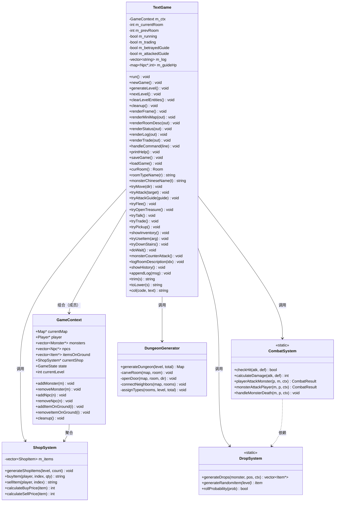
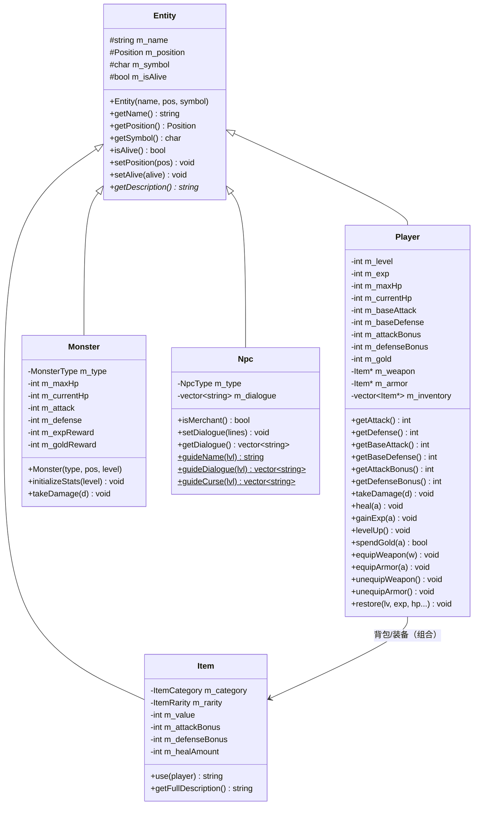
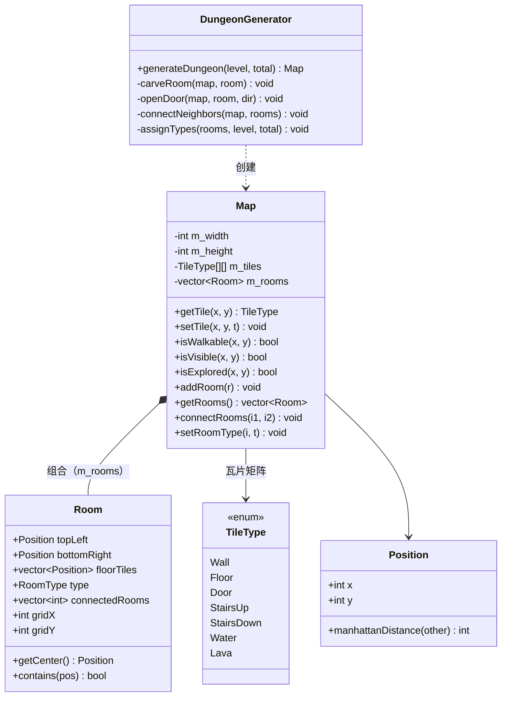

# 文字版地牢 MUD · 完整技术文档

> 版本：v2.4（含存档/读档、战斗血量显示、向导全局咒骂、消耗品修复、数值平衡调整、装备显示与数值拆分、背包满不丢物品、丢弃命令、宝箱隐藏）· 2026-09
> 项目：`mud_text/Code-class-MUD-game-text`（C++17 终端文字冒险游戏）
> 代码仓库：https://github.com/BugMaker-orz/Code-class-MUD-game （main 分支，版本演进见第 18 章）
> 阅读对象：未接触过本项目的开发/评审/互测同学

---

## 1. 项目概述

纯文字版 MUD（Multi-User Dungeon 风格）地牢探险游戏：**没有二维图形界面，全部用中文文字与字符画交互**。玩家扮演勇者，通过输入命令探索 5 层地牢、战斗、交易、对话，最终击败魔王。支持**双结局**（勇者线 / 叛徒线）与**存档读档**。

### 1.1 一句话玩法

> 输入 `去 东` 移动 → `攻击 哥布林` 战斗 → `对话` 听剧情 → `交易` 买装备 → `下楼` 进入下一层 → 第 5 层击败魔王通关。

### 1.2 开发历程与版本取舍

项目最初尝试过带二维地图 UI 的图形版，但实际开发中发现二维渲染（地图绘制、视野计算、逐帧刷新）性能不理想，画面经常丢帧，交互体验较差。权衡之后放弃了二维地图版本，把重点放在纯文字版上：全部交互改为命令输入，保留战斗、商店、掉落、地牢生成等核心玩法。因此本项目只包含 `src/text/` 专属层与核心层（角色/战斗/物品/地图），不涉及任何二维地图渲染代码。

## 2. 技术栈与环境

| 项 | 说明 |
| --- | --- |
| 语言标准 | C++17 |
| 构建 | CMake ≥ 3.15 |
| 平台 | Windows（MSVC / MinGW）/ Linux / macOS 均可编译 |
| 中文编码 | 源码 UTF-8；MSVC 由 CMake 强制 `/utf-8` 编译 |
| 控制台 | Windows 下 `setupConsole()` 将代码页切到 UTF-8 并开启 `ENABLE_VIRTUAL_TERMINAL_PROCESSING`（ANSI 彩色生效）；旧版 MinGW 的 wincon.h 未定义该常量，CMake 已手动补上 `=0x0004`（v2.31） |
| 依赖 | 仅标准库（iostream/fstream/vector/map/optional/algorithm），无第三方库 |

### 2.1 编译运行

```bash
mkdir build && cd build
cmake .. && cmake --build .     # Windows: mud_text.exe / Linux: mud_text
./mud_text                      # 可选参数：./mud_text 42 固定随机种子
```

## 3. 目录结构

```
Code-class-MUD-game-text/
├── CMakeLists.txt              # 只编译文字版需要的 13 个源文件
└── src/
    ├── text/                   # ★ 文字版专属层
    │   ├── main_text.cpp       #   入口：控制台初始化 + srand + run()
    │   ├── TextGame.h          #   游戏主控类声明（80 行）
    │   └── TextGame.cpp        #   主控实现（1379 行，含存档/读档）
    ├── core/
    │   ├── Entity.h            #   实体基类（名字/坐标/符号/存活）
    │   ├── GameContext.h/.cpp  #   全局游戏上下文（玩家/怪物/NPC/物品容器）
    │   ├── Position.h          #   坐标结构
    │   └── TileType.h          #   瓦片类型枚举
    ├── character/
    │   ├── Player.h/.cpp       #   玩家（属性/升级/背包/装备/restore）
    │   ├── Monster.h/.cpp      #   怪物（属性由 类型+层数 确定）
    │   └── Npc.h/.cpp          #   NPC（向导/商人，逐层台词与咒骂）
    ├── combat/
    │   └── CombatSystem.h/.cpp #   战斗结算（含剩余血量显示）
    ├── map/
    │   ├── Map.h/.cpp          #   房间地图数据
    │   └── DungeonGenerator.h/.cpp #   分层地牢生成器
    └── item/
        ├── Item.h/.cpp         #   物品（类别/稀有度/加成/使用）
        ├── DropSystem.h/.cpp   #   掉落表
        └── ShopSystem.h/.cpp   #   商店（买入/卖出）
```

## 4. 类设计与类图

### 4.1 核心类职责

| 类 | 职责 | 关键成员 |
| --- | --- | --- |
| `TextGame` | 主控：主循环、命令分发、渲染、存档/读档 | `m_ctx`、`m_currentRoom`、`m_log`、`m_guideHp`、`m_attackedGuide`、`m_betrayedGuide` |
| `GameContext` | 全局状态容器 | `currentMap`、`player`、`monsters`、`npcs`、`itemsOnGround`、`currentShop`、`state` |
| `Player` | 玩家属性/背包/装备 | `m_level/m_exp/m_maxHp/m_gold`、`m_inventory`、`m_weapon/m_armor` |
| `Monster` | 怪物（属性由类型+层数确定） | `m_type`、`m_currentHp` |
| `Npc` | 向导/商人（逐层台词） | `m_type`、`m_dialogue` |
| `Item` | 物品（武器/护甲/药水/金币等） | `m_category/m_rarity/m_attackBonus/m_healAmount` |
| `Map` | 房间网格与连通 | `m_rooms`（每个 Room 含 gridX/gridY/type/connectedRooms） |
| `DungeonGenerator` | 每层地牢生成（拓扑固定+类型随机） | `m_config`（每层 6 房、13×9） |
| `CombatSystem` | 伤害/命中/掉落结算 | `calculateDamage/checkHit/playerAttackMonster` |
| `DropSystem` | 怪物掉落表 | `getGoblinDropTable()` 等 6 张表 |
| `ShopSystem` | 商店货架 | `m_items`（ShopItem 列表） |

### 4.2 UML 类图：主控层



### 4.3 UML 类图：实体层（继承体系）



### 4.4 UML 类图：地图层与基础层



### 4.5 类间关系小结

| 关系 | 类型 | 说明 |
| --- | --- | --- |
| `TextGame -- GameContext` | 组合 | `m_ctx` 为值成员，主控类持有全局状态 |
| `TextGame -- 各系统类` | 依赖 | 直接调用静态系统函数，不持有 |
| `GameContext -- Map/Player/Monster/Npc/Item` | 聚合 | 通过指针/容器持有，由 `cleanup()` 统一释放 |
| `Player -- Item` | 组合 | 背包 `m_inventory`、装备 `m_weapon/m_armor`，析构时释放 |
| `Map -- Room` | 组合 | `m_rooms` 内嵌结构体，随 Map 生命周期 |
| `Entity <|-- Player/Monster/Npc/Item` | 继承 | 多态：`getDescription()` 纯虚接口 |

## 5. 游戏主循环与状态机

```
run() 启动
  └─ newGame()：清场 → 建玩家 → generateLevel() → 进入第 1 层
       └─ 主循环 while(m_running)：
            ① 死亡? → 结算界面（N 重开 / Q 退出）
            ② 胜利? → 结局结算（N 重开 / Q 退出）
            ③ renderFrame()：标题 → 小地图 → 当前位置 → 日志 → 状态
            ④ 交易子界面? → renderTrade() 渲染货架
            ⑤ 等待输入 → handleCommand() 分发
            ⑥ 回到①
```

`GameContext::GameState` 状态：`Menu → Playing ⇄ (Dead | Victory)`

## 6. 命令系统（全部命令，中英双语）

> 所有命令均支持中英双语别名（大小写不敏感），便于演示与国际化评审。解析实现：`handleCommand()` 将输入 `trim + tolower` 后按前缀/全等匹配中文与英文别名，剩余参数用 `argAfter()` 切取。

| 功能 | 中文命令 | 英文别名 |
| --- | --- | --- |
| 移动 | `去 东/西/南/北` | `go east` / `move north` / `east` |
| 攻击 | `攻击 [怪物名]` | `attack` / `atk`（如 `attack goblin`） |
| 攻击向导 | `攻击 向导` | `attack guide` |
| 逃跑 | `逃跑` | `flee` / `run` |
| 开宝箱 | `开宝箱` | `open` |
| 对话 | `对话` | `talk` |
| 交易 | `交易` | `shop` / `trade` |
| 拾取 | `拾取` | `pick` / `get` |
| 丢弃 | `丢弃 N` | `drop N` |
| 背包 | `背包` | `inv` / `bag` / `i` |
| 使用/装备 | `使用 N` | `use N` |
| 下楼 | `下楼` | `down` / `stairs` |
| 等待 | `等待` | `wait` |
| 查看 | `查看` | `look` / `re` |
| 历史 | `历史` | `history` / `log` |
| 保存 | `保存` | `save` |
| 读取 | `读取` | `load` |
| 帮助 | `帮助` | `help` / `?` |
| 退出 | `退出` | `quit` / `q` / `exit` |
| 商店买 | `买 N` | `buy N` |
| 商店卖 | `卖 N` | `sell N` |
| 商店离开 | `离开` | `close` |

> 交易子界面内只接受：`买 N` / `卖 N` / `离开`（`buy` / `sell` / `close`）。

## 7. 战斗系统

### 7.1 公式

| 公式 | 计算 |
| --- | --- |
| 伤害 | `max(攻 − 防/2, 1) + rand(0..2)` |
| 命中率 | `clamp(70 + 攻×2 − 防×2, 20, 95)%` |
| 升级经验 | `60 + 等级 × 30`（1→2 级需 90，逐级 +30，v2.2 加快） |
| 升级成长 | 满血 +5、基础攻 +1、基础防 +1 |
| 商店买价 | `价值 × 2`；卖价 `价值 / 2` |

> **升级机制（v2.2）**：升级经验曲线为 `60 + 等级×30`（1→2 级需 90，逐级 +30），升级成长满血 +5、攻/防 +1。经验溢出会跨级消化——读档恢复的高经验在 `gainExp` 中用 while 循环连续升级（每次升级回满血），不会卡在升级门槛前。

### 7.2 回合流程（玩家先手）

```
玩家输入「攻击 名字」
  ├─ 命中失败 → 「你挥剑攻击哥布林，可惜落空了！（哥布林 HP 5/10）」
  ├─ 命中且未击杀 → 「你攻击哥布林，造成 4 点伤害！（哥布林 HP 1/10）」
  │     └─ 怪物反击 → 「哥布林 攻击了你，造成 3 点伤害！（哥布林 HP 1/10）」
  └─ 命中且击杀 → 「你攻击哥布林，造成 6 点伤害！哥布林 被击败了！获得 6 经验，2 金币。」
        └─ 掉落自动拾取（金币加钱，物品进背包）
        └─ 背包已满（v2.4）：非金币掉落物不再消失，真实落在怪物死亡位置的地上，提示可稍后「拾取」
```

**v2.0 特性**：所有战斗结算消息都带怪物剩余血量 `（名字 HP 当前/满血）`，与攻击向导的显示格式一致，玩家无需 `查看` 即可判断是否补刀。

### 7.3 怪物属性表（由类型+层数决定，确定性无随机）

| 怪物 | 满血 | 攻 | 防 | 经验 | 金币 |
| --- | --- | --- | --- | --- | --- |
| 哥布林 | 10+层×2 | 3+层 | 1 | 10+层×2 | 5+层 |
| 骷髅兵 | 15+层×3 | 5+层 | 3 | 15+层×3 | 8+层 |
| 蝙蝠 | 5+层 | 2+层 | 0 | 5+层 | 1 |
| 史莱姆 | 8+层×2 | 1+层 | 0 | 5+层 | 2 |
| 兽人 | 25+层×4 | 8+层 | 5 | 30+层×5 | 15+层 |
| 魔王 | 60+层×10 | 10+层 | 7 | 100+层×10 | 50+层 |

## 8. 向导机制（特色玩法）

### 8.1 攻击向导

每层起点房有一位向导。玩家可输入 `攻击 向导` 夺取强力资源：

- 向导血量：`40 + 层×15`（跨命令存于 `m_guideHp`，map<Npc*,int>）
- 击杀奖励：金币 `50+层×25`、经验 `80+层×40`、史诗装备「向导秘宝剑」（攻+5+层）+「向导秘银甲」（防+3+层）
- 向导反击：`calculateDamage(3+层, 玩家防御)`

### 8.2 全局咒骂（v2.0）

新增标记 `m_attackedGuide`：**攻击过任意一个向导即置 true，此后全地牢所有向导**（含其他楼层从未被打过的）**拒绝对话并咒骂**：

```
你试图与【工头·大锤】搭话……
工头·大锤：滚开！跟你没什么好说的！
大锤：滚！老子给你指过路，你反手就给老子一剑？
大锤：白眼狼，矿洞塌方我可不给你收尸！
（向导拒绝提供任何剧情信息。叛徒之路，没有回头路。）
```

咒骂台词逐层不同（见 Npc.cpp `guideCurse(lvl)`），全部鲜红色。`m_attackedGuide` 随存档保存（`attacked=0/1`），读档后保持。

### 8.3 双结局

| 路径 | 击败魔王后的结局 |
| --- | --- |
| 未背叛（`m_betrayedGuide=false`） | 勇者结局：地牢恢复和平，传说被写进史书 |
| 背叛（击杀过向导） | 新魔王结局：深渊王座认主，成为新的魔王 |

`m_betrayedGuide` 仅在**击杀**向导时置 true；`m_attackedGuide` 只要攻击就置 true（两者独立）。

## 9. 每层 NPC 剧情（逐层推进 + 整活）

| 层 | 向导 | 人设 | 剧情要点 |
| --- | --- | --- | --- |
| 1 | 守门人·老马 | 腰不好的守门人 | 介绍玩法与魔王背景 |
| 2 | 工头·大锤 | 矿工头子 | 爆料：魔王是被炼金术士的助手坑出来的 |
| 3 | 修女·阿贞 | 临时修女 | 补充：助手其实是魔王旧部 |
| 4 | 队长·刀疤 | 巡逻队长 | 魔王情报：眼睛比城门大，单行道 |
| 5 | 神秘人·黑哥 | 神秘人 | 魔王想家了，命运交给你，赢了他请吃烤串 |

商人台词也逐层变化（如第 5 层：「最后一条命了哥们，买二送一，送的那瓶可能是空的」）。

## 10. 地牢生成

`DungeonGenerator`：

- 每层 6 个房间，**每房最多 4 个相邻房间**；
- 布局交替：奇数层横排 3×2，偶数层竖排 2×3，第 5 层横排（魔王层无楼梯）；
- 房间 13×9（含墙，内部 11×7，面积充足）；
- 房间类型：起点固定房间 0，其余随机分配（Boss/楼梯/商店/宝箱/普通），**类型分配用 rand()，拓扑固定**——这是存档必须记录 `rtype` 的原因；
- 全视野（`setVisible/setExplored` 全部 true）。

小地图为字符画布 `rows×2−1` 行 × `cols×4−1` 列，节点 `[@]` 亮蓝表示玩家，`B` 鲜红表示魔王，其余白色；`-`/`|` 表示连通。

## 11. 存档/读档

### 11.1 文件

`save_mud.txt`（UTF-8 文本，可执行文件工作目录），格式为 `键=值` 与带前缀记录行的混合。

### 11.2 保存内容（全量）

| 分组 | 字段 |
| --- | --- |
| 头信息 | `level`、`room`、`prevRoom`、`betrayed`、`attacked`、`trading` |
| 玩家 | `p_level/p_exp/p_maxhp/p_hp/p_baseAtk/p_baseDef/p_gold` |
| 背包 | `inv`（物品行×N）、`weapon_idx`、`armor_idx` |
| 当前层 | `rtype`（房间类型，空格分隔）、`stairs_room` |
| 实体 | `mon`（类型|残血|X|Y）、`npc`（类型|名|X|Y）、`guide_hp` |
| 物品 | `ground`（物品行|X|Y）、`shop`（物品行|买价|卖价）、`chest_open`（已打开宝箱房下标，空格分隔，v2.4） |
| 日志 | `log`（每条一行，含 ANSI 色码） |

物品行：`类别|稀有度|名字|符号|价值|攻击加成|防御加成|治疗量|堆叠数`

### 11.3 设计要点

- **怪物属性不落盘**：由 `类型+层数` 确定性重建，只存残血；
- **房间类型必须落盘**：随机分配，否则读档后楼层布局错乱；
- **向导血量**：存 `guide_hp`，读档写回 `m_guideHp[新指针]`；
- **基础攻防**：存 `当前值−装备加成`，读档重新装备时再加回；
- **`attacked`**：v2.0 新增字段，旧存档缺省按 false 处理（向前兼容）。
- **`chest_open`**：v2.4 新增字段，记录已打开的宝箱房下标，防读档后重复开箱刷宝；旧存档无此字段默认全未开（向前兼容）。
- **基础攻防/背包/地面物品**：装备已穿戴则基础值存`当前值−装备加成`；背包满时开宝箱/拾取/掉落失败，物品保留在地上不消失。

### 11.4 恢复流程

```
loadGame()
  解析文件（前缀分流 → kv map）
  → 校验版本/楼层(1~5)
  → cleanup() 清空当前局
  → 恢复控制变量（level/betrayed/attacked/trading/log）
  → 恢复玩家（restore + 物品 + equip）
  → 恢复地图（生成拓扑 + rtype 覆盖 + 楼梯 tile + 全视野）
  → 恢复怪物/NPC/地上物品/商店
  → 玩家落位 rooms[room].center() → state=Playing
```

## 12. 彩色输出约定（ANSI）

| 用途 | 颜色 | 示例 |
| --- | --- | --- |
| 危险/敌人/咒骂/警告 | 鲜红 `\033[91m` | 攻击向导提示、怪物名 |
| 信息标题 | 绿 `\033[92m` | 【信息】、存档成功 |
| 房间名/NPC/奖励 | 黄 `\033[93m` | 【起点房】、商人名 |
| 小地图当前位置 | 亮蓝 `\033[94m` | `[@]` |
| 状态/魔王标题 | 品红 `\033[95m` | 【状态】、新魔王结局 |
| 主标题/小地图标题 | 青 `\033[96m` | 游戏标题 |
| 强力资源 | 橙 `\033[38;5;208m` | 向导秘宝剑、金币 |
| 正文 | 白 `\033[37m` | 普通描述 |

> Windows 10+ 自带终端默认支持；极老终端需 Windows Terminal。

## 13. 装备显示与数值拆分（v2.3）

### 13.1 状态栏

```
【状态】【勇者】 HP 36/36 | 等级 1 | 攻 6(+3) | 防 3(+1) | 金币 0 | 经验 0/90
装备：[武器:精钢剑][护甲:皮甲]
```

- **攻/防**显示为 `基础值(+装备加成)`：基础值来自 `Player::getBaseAttack()/getBaseDefense()`，加成来自 `getAttackBonus()/getDefenseBonus()`（武器/护甲加成之和），无加成时只显示基础值；
- **状态栏装备行**：单独一行列出当前武器/护甲（无则 `[武器:无][护甲:无]`），玩家不用翻背包即可确认身上装备。

### 13.2 背包标记

背包列表中被装备的武器/护甲带 `【已装备】` 黄色标记，例如：

```
[1] 【已装备】[精良]精钢剑（武器，攻击+1）价值 25 金币
[2] [普通]治疗药水（药水，恢复10）价值 10 金币
```

### 13.3 实现

- `Player` 新增 4 个 getter：`getAttackBonus()`、`getDefenseBonus()`、`getWeapon()`、`getArmor()`；
- 存档时基础攻防存 `当前值−装备加成`，读档重新装备再加回，避免跨档重复累加加成；
- 丢弃/出售已装备物品时先 `unequipWeapon()/unequipArmor()` 再移除，防止加成残留。

## 14. 端到端测试记录（v2.4 实测通过）

| # | 场景 | 结果 |
| --- | --- | --- |
| 1 | 攻击怪物：命中/落空/反击/击杀 | 消息均带 `（怪物 HP x/y）`，击杀显示战利品 |
| 2 | 攻击向导后对话 | 该层向导咒骂（鲜红） |
| 3 | 攻击任意向导后跨层对话 | 其他层向导同样咒骂 |
| 4 | 存档 → 读档（换随机种子） | 玩家 HP/金币/经验/楼层全部还原 |
| 5 | 残血怪物存档 → 读档 | 怪物显示 HP 5/12（残血保留） |
| 6 | 向导残血存档 → 读档再攻击 | 从 40 结算：40−7=33/55 |
| 7 | 下到第 2 层存档 → 读档 | 标题、布局、日志全部还原 |
| 8 | 读档后攻击过向导（attacked=1） | 对话仍咒骂 |
| 9 | 双结局 | 未背叛 → 勇者；击杀向导 → 新魔王 |
| 10 | 装备显示 | 状态栏 `攻 6(+3)`、`装备：[武器:精钢剑]`；背包带 `【已装备】` 标记 |
| 11 | 存档攻防还原 | 装备后存档→读档，基础值不变、加成一致，攻/防不重复累加 |
| 12 | 背包满拾取 | 20 格满时拾取非金币物品 → 提示「背包已满，无法拾取」，物品留地不消失 |
| 13 | 背包满掉落 | 满包击杀怪物 → 「XX 掉在了地上，可稍后拾取」，落地点=死亡位置 |
| 14 | 背包满开宝箱 | 满包开宝箱 → 金币入账、物品「从宝箱里滑落在地」，宝箱置为已开 |
| 15 | 丢弃物品 | 「丢弃 N」→ 掉在当前房间地上可拾回；装备自动卸下（防加成残留） |
| 16 | 宝箱隐藏 | 未开宝箱房只显示宝箱不泄露内容物；已开后显示地上物品；读档不重复开箱 |

## 15. 已知限制与扩展方向

| 限制 | 说明 | 扩展建议 |
| --- | --- | --- |
| 单存档位 | 只一个 save_mud.txt 覆盖式保存 | 多槽位 `保存 1/2/3` |
| 英文命令 | 已有部分英文别名，未全覆盖 | 命令表补全英文 |
| 存档明文 | 可手动改金币 | 加 CRC 校验 |
| 注释密度 | 核心文件有注释，其余偏低 | 互测前补关键函数注释 |
| 丢弃物品无回收站 | 丢弃后物品留地，换层后清空 | 增加每层遗留物跨层保留 |

## 16. 快速上手指南（评审演示用）

```
./mud_text 42
去 东          → 进战斗房
攻击           → 打一回合（看剩余血量）
攻击 向导      → 试背叛玩法（鲜红提示）
对话           → 向导咒骂（全地牢生效）
保存           → 写存档
退出 / 读取    → 验证读档
```

## 17. 答辩常见问题（FAQ）

> 本节整理评审老师可能提出的问题与回答要点，供答辩前复习；每个问题的答案均可在本文档对应章节找到依据。

### 17.1 为什么选择纯文字（MUD）而不是图形界面？

**答**：①课程核心是 C++ 面向对象与数据结构设计，文字版把复杂度集中在"对象建模、状态机、命令解析、存档持久化"上，图形界面反而会稀释重点；②早期开发过二维地图渲染版，实测发现逐帧刷新（房间地图+信息+小地图+状态栏）在终端里频繁重绘掉帧，遂砍掉渲染层，保留文字版迭代（见第 8 章开发历史说明）；③纯命令行零依赖，跨平台、易演示、易自动化测试。

### 17.2 命令解析是怎么实现的？为什么支持中英双语？

**答**：`TextGame::handleCommand()` 把用户输入 `trim` 去空白、`tolower` 归一化后，先按交易子界面分流（`买/卖/离开`），再对 18 类命令逐一做"全等匹配（如 `攻击`、`attack`）或前缀匹配（如 `去 东`、`go east`）"，中文与英文别名映射到同一个处理函数（如 `tryFlee()` / `tryOpenTreasure()` / `tryDropItem()`）。参数用 `argAfter(cmd, 前缀)` 切取剩余部分。英文别名是 v2.4 文档整理时逐条核对的，代码自 v1.0 起即内置 `go/attack/flee/open/talk/shop/pick/inv/use/down/wait/look/history/save/load/help/quit` 等别名（见第 6 章）。

### 17.3 地牢地图是怎么生成的？如何保证每层 6 房、每房最多 4 邻？

**答**：`DungeonGenerator` 先把每层 6 个房间排成 2×3 矩形网格（奇数层横排、偶数层竖排，元气骑士式交替），按"相邻格子→开门→连接"生成基础连通图，再按 2D 四邻域（上/下/左/右）建邻接关系——所以每房最多 4 个出口；之后随机打乱房间类型（起点固定 1 个、楼梯 1 个、宝箱/商店各 1~2 个、其余战斗房）并随机化入口房间（见第 10 章）。

### 17.4 战斗系统的数值是怎么平衡的？

**答**：命中率 `clamp(70+攻×2−防×2, 20%, 95%)`，伤害 `max(攻−防/2,1)+rand(0..2)`，玩家先手，怪物属性由"类型+层数"确定性生成（如哥布林满血 `10+层×2`），无随机浮动、可复现；升级曲线 `60+等级×30`（1→2 级 90 经验，逐级 +30），读档高经验用 while 循环跨级消化（见第 7 章）。数值调整过程：v2.1 修复满血消耗、v2.2 削弱魔王（攻 12+层→10+层、防 8→7）并加快升级。

### 17.5 双结局是怎么实现的？

**答**：全局标记 `m_attackedGuide`（存档字段 `attacked`）。击败魔王时判断：未攻击向导 → 勇者结局；攻击过向导 → 新魔王结局。攻击向导后所有向导拒绝对话并咒骂，跨层一致（见第 8 章）。

### 17.6 存档格式为什么不加密？为什么用文本？

**答**：课程设计以清晰、可读、可评审为先：文本格式 `键=值` 易于人工检查与演示"存档→读档→还原"；同时文本格式天然规避结构体对齐/大小端差异，跨平台兼容。已知限制已记录（可手动改金币），扩展方向是加 CRC 校验（见第 15 章）。

### 17.7 背包满时为什么物品不会消失？

**答**：v2.4 修复。`Player::addItem()` 容量满时返回 `false` 且不吞物品，调用方（拾取/掉落/开宝箱/商店购买）各自处理：拾取→留地提示；怪物/Boss/向导掉落→物品真实落在死亡位置地上；开宝箱→"从宝箱里滑落在地"；商店购买→扣款前先查 `getFreeSlots()`，满了拒绝且不扣钱（见第 13、14 章测试记录 12~15 项）。

### 17.8 项目是怎么做测试的？有多少测试？

**答**：采用"固定随机种子（seed 42）命令流回归 + 手工构造存档"两种方式做端到端测试：固定种子保证地图可复现，命令流逐帧核对输出；构造满背包存档（20 格）验证满包场景。当前 16 项测试全部通过（见第 14 章），另有与他组的互测报告（含代码/功能双维度 50 分制评分）。

## 18. 版本演进与 Git 记录

项目全程使用 Git 做版本管理并托管于 GitHub（https://github.com/BugMaker-orz/Code-class-MUD-game），共 15 个提交。版本演进如下：

| 版本 | 提交 | 关键内容 |
| --- | --- | --- |
| v1.0 | `b6b06d7` → `0eee654` | 初始提交：文字版地牢 MUD（C++17）+ 技术文档初稿（第三人称改写） |
| v2.0 | `70b7a2c` | 存档/读档系统、战斗消息显示怪物剩余血量、攻击向导→全局咒骂 |
| v2.1 | `daf8bc8` | 消耗品修复：满血不消耗、消耗品用后消失、装备保留 |
| v2.2 | `7930976` / `d0e830c` | 数值平衡：魔王削弱、升级曲线加快（60+等级×30）、溢出经验跨级消化；文档同步 |
| v2.3 | `2dbea79` | 装备显示与数值拆分：基础值(+加成)、状态栏装备行、背包【已装备】标记 |
| v2.31 | `4745605` | 旧版 MinGW 兼容（ENABLE_VIRTUAL_TERMINAL_PROCESSING=0x0004） |
| 文档 | `0b1e79b` → `5290e4e` | UML 类图扩充、Mermaid 渲染修复、源码注释补全、课程大纲 PDF |
| v2.4 | `2a3a892` | 背包满不丢物品（拾取/掉落/宝箱/商店）、新增丢弃命令、宝箱内容隐藏；文档同步 |

> 开发历史：早期存在二维地图渲染版，因终端逐帧刷新掉帧而放弃，专注纯文字版（提交 `8fc0b04` 有说明）。Git 记录同时作为小组协作与版本管理的佐证（对应实验报告第十章分工）。
